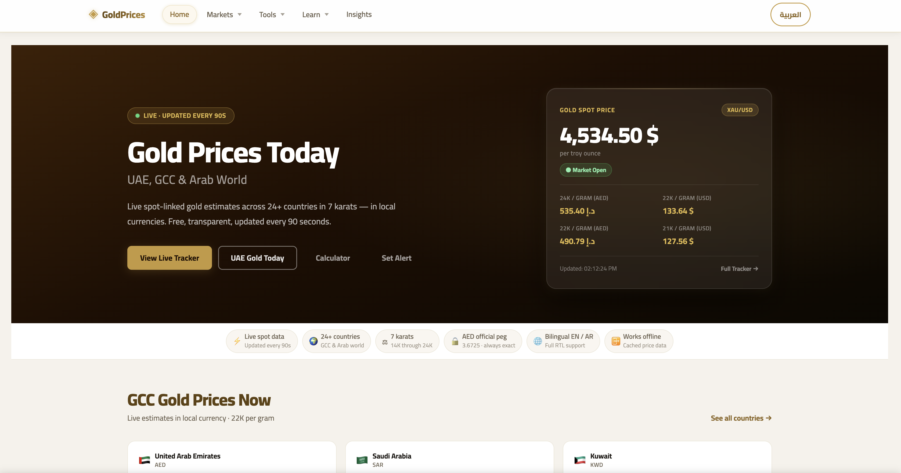
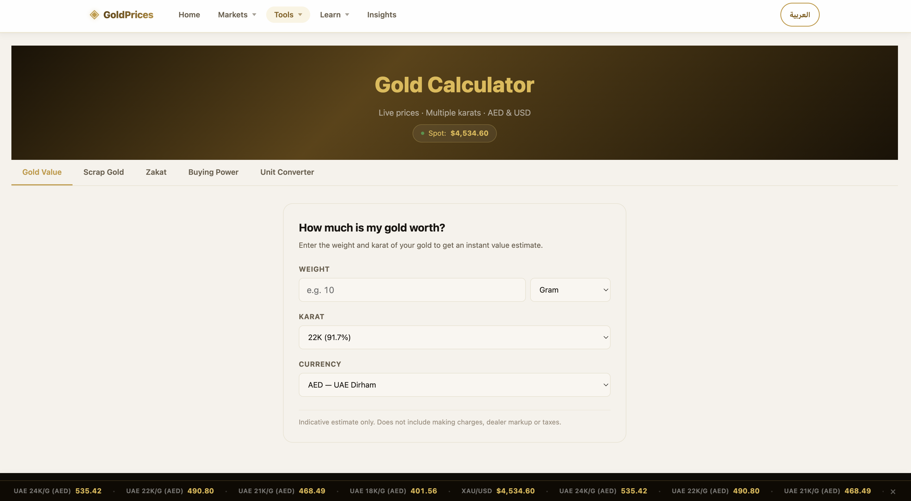

# Gold Price Tracker | متتبع أسعار الذهب

A bilingual (English/Arabic) web app for live gold prices with local currency estimates across GCC, Levant, and African markets.

## Live Demo
[Open the site](https://vctb12.github.io/Gold-Prices/)

## Highlights
- Live gold spot pricing
- Karat-based calculations
- Multi-country local currency estimates
- English + Arabic UI
- Calculator, charts, and downloadable exports
- Offline-friendly behavior

## Screenshots




## Features

- **Live XAU/USD spot price** — refreshed every 90 seconds
- **Daily FX conversions** — 24 countries, refreshed once per day
- **AED fixed peg** — hardcoded at 3.6725 (official UAE Central Bank peg)
- **7 karats** — 24K, 22K, 21K, 20K, 18K, 16K, 14K with purity-adjusted prices
- **Per gram and per ounce** — toggle between units
- **Bilingual UI** — English (default) and Arabic with full RTL layout
- **Price change panel** — vs previous fetch and vs Dubai day open
- **Offline-first** — localStorage cache with 5-tier graceful degradation
- **Export** — CSV and JSON per tab
- **Debug mode** — simulate API failures, inspect state

## Countries

| Tab | Countries |
|-----|-----------|
| **GCC** | UAE, Saudi Arabia, Kuwait, Qatar, Bahrain, Oman |
| **Levant** | Jordan, Lebanon, Syria, Palestine |
| **North & East Africa** | Egypt, Libya, Tunisia, Algeria, Morocco, Sudan, Somalia, Mauritania, Djibouti, Comoros |
| **Global Reference** | USA, United Kingdom, Eurozone, India |

## Data Sources

| Source | Used for | Freshness |
|--------|----------|-----------|
| [Gold API](https://gold-api.com) | XAU/USD spot price | Every 90 seconds |
| [ExchangeRate-API](https://open.er-api.com) | Currency conversion | Once daily |
| Hardcoded `3.6725` | AED only | Permanent peg |

> **Note:** All prices are estimated bullion-equivalent values. Retail and jewelry prices may differ. Not financial advice.

## Getting Started

```bash
git clone <repo-url>
cd Gold-Prices
python3 -m http.server 8080
# Open http://localhost:8080
```

No build step, no dependencies, no API keys required.

## File Structure

```
Gold-Prices/
├── index.html              # Semantic HTML shell (all text via data-i18n)
├── style.css               # Theme, RTL layout, responsive grid
├── app.js                  # Main orchestrator
├── config/
│   ├── constants.js        # API URLs, AED peg, timeouts
│   ├── countries.js        # 24 countries with search aliases
│   ├── karats.js           # 7 karat purities with EN/AR labels
│   ├── translations.js     # All UI strings in English and Arabic
│   └── index.js            # Central re-export
└── lib/
    ├── api.js              # Data fetching with retry logic
    ├── cache.js            # localStorage dual-layer persistence
    ├── price-calculator.js # Pure price formulas
    ├── formatter.js        # Price, timestamp, countdown formatting
    ├── search.js           # Bilingual full-text search
    ├── export.js           # CSV and JSON export
    ├── history.js          # 90-day snapshots and volatility
    └── debug.js            # Debug panel (?debug=true)
```

## Price Calculations

```
1 troy ounce = 31.1035 grams

usdPerGram(karat) = (spotUsdPerOz / 31.1035) × purity
usdPerOz(karat)   = spotUsdPerOz × purity
localPrice        = usdPrice × fxRate

AED: always usdPrice × 3.6725 (never from FX API)
```

## Caching & Offline Behavior

| State | Gold | FX | Behavior |
|-------|------|----|----------|
| 1 | Live | Live | Full precision, green/amber badges |
| 2 | Live | Stale | FX amber badge, "FX X hours old" |
| 3 | Stale | Live | Gold amber badge, prices still work |
| 4 | Both stale | Both stale | Dual badges, renders from cache |
| 5 | No cache | No cache | Empty state + retry button |

## Debug Mode

Add `?debug=true` to the URL:

```
http://localhost:8080/?debug=true
```

Shows a panel with:
- Simulate gold API failure
- Simulate FX API failure
- Clear all localStorage cache
- Live STATE inspector

## Browser Support

Chrome 90+, Firefox 88+, Safari 14+, iOS Safari 14+, Android Chrome 90+

Requires: ES6 modules, `fetch`, `localStorage`, `navigator.clipboard`, `Intl`

## License

MIT
