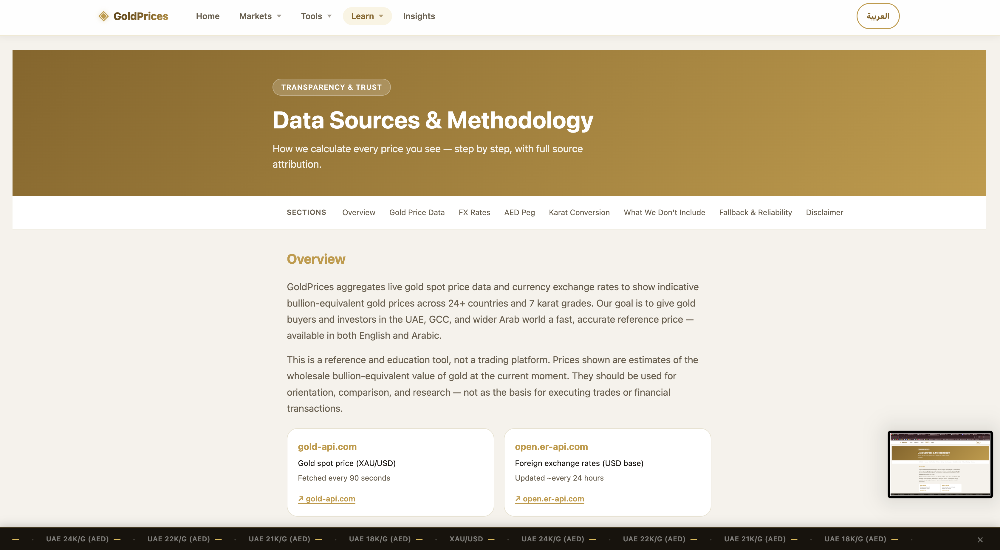

<div align="center">

# GoldPrices  
### Live Gold Tracker for UAE, GCC & Arab Markets  
### أسعار الذهب المباشرة

A bilingual gold price platform built for the UAE, GCC, Levant, North & East Africa, and selected global markets — with live spot-linked pricing, calculators, historical views, exports, alerts, and country pages.

<p>
  <a href="https://vctb12.github.io/Gold-Prices/">
    
  </a>
  <a href="https://vctb12.github.io/Gold-Prices/insights.html">
    
  </a>
  <a href="https://vctb12.github.io/Gold-Prices/calculator.html">
    
  </a>
</p>

<p>
  
  
  
  
  
  
</p>

</div>

---

## Overview

**GoldPrices** is a web app for tracking live gold prices across the GCC, Arab world, and selected global markets.

It combines:

- live **XAU/USD spot-linked pricing**
- **local currency estimates**
- **historical price views**
- **browser-based alerts and presets**
- **gold calculators**
- **country-specific pages**
- **CSV / JSON exports**
- **English + Arabic support with RTL**

The goal is simple: make gold data easier to follow, compare, and use.

---

## Quick Links

- **Main site:** [vctb12.github.io/Gold-Prices](https://vctb12.github.io/Gold-Prices/)
- **Insights:** [tracker.html](https://vctb12.github.io/Gold-Prices/insights.html)
- **Calculator:** [calculator.html](https://vctb12.github.io/Gold-Prices/calculator.html)

---

## Table of Contents

- [Highlights](#highlights)
- [Screenshots](#screenshots)
- [Feature Breakdown](#feature-breakdown)
- [Supported Markets](#supported-markets)
- [Main Pages](#main-pages)
- [Data Sources](#data-sources)
- [Getting Started](#getting-started)
- [Project Structure](#project-structure)
- [Price Logic](#price-logic)
- [Offline & PWA Behavior](#offline--pwa-behavior)
- [Why This Project](#why-this-project)
- [License](#license)

---

## Highlights

- **Live gold spot pricing**
- **7 tracker karats** with purity-adjusted values
- **24+ supported markets**
- **English + Arabic UI**
- **RTL support**
- **Historical archive and date lookup**
- **Browser-based alerts and presets**
- **Gold calculators**
- **CSV / JSON exports**
- **Offline-friendly behavior**
- **Country landing pages**
- **PWA install support**

---

## Screenshots

<p align="center">
  
  
  
</p>

---

## Feature Breakdown

### Live Market Tracking

- **Live XAU/USD spot price** refreshed roughly every 90 seconds
- **Daily FX conversion** for supported markets
- **AED fixed peg** using the official `3.6725` AED/USD value
- **Per gram and per ounce** views
- **7 karats**:
  - 24K
  - 22K
  - 21K
  - 20K
  - 18K
  - 16K
  - 14K
- **Price context** and comparison across views
- **Bilingual interface** with English and Arabic

### Tracker Workspace

The live tracker is organized into multiple modes:

| Mode | Purpose |
|------|---------|
| **Live** | Live chart, key metrics, karat ladder, watchlist, decision cues |
| **Compare** | Compare markets and rank by selected view |
| **Archive** | Browse historical data and run date lookup |
| **Alerts** | Save local browser alerts and presets |
| **Planner** | Budget, position, jewelry estimate, and accumulation planning |
| **Exports** | CSV, JSON, and brief downloads |
| **Method** | Sources, pricing methodology, and transparency notes |

### Calculator Tools

The calculator page includes:

- **Gold Value Calculator**
- **Scrap Gold Calculator**
- **Zakat on Gold Calculator**
- **Buying Power Calculator**
- **Weight Unit Converter**

### Extra Platform Features

- **PWA manifest** and installable shortcuts
- **Service worker caching**
- **Country-specific pages**
- **Learn / glossary content**
- **Insights pages**
- **Methodology page**
- **Local persistence with `localStorage`**
- **Shareable state / preset-friendly workflow**

---

## Supported Markets

| Region | Countries |
|--------|-----------|
| **GCC** | UAE, Saudi Arabia, Kuwait, Qatar, Bahrain, Oman |
| **Levant** | Jordan, Lebanon, Syria, Palestine |
| **North & East Africa** | Egypt, Libya, Tunisia, Algeria, Morocco, Sudan, Somalia, Mauritania, Djibouti, Comoros |
| **Global Reference** | USA, United Kingdom, Eurozone, India |

---

## Main Pages

| Page | Purpose |
|------|---------|
| `index.html` | Landing page and main hub |
| `tracker.html` | Full live gold tracker workspace |
| `calculator.html` | Gold calculators and conversion tools |
| `learn.html` | Educational content and glossary |
| `insights.html` | Market context and gold-related insights |
| `methodology.html` | Sources, formulas, and transparency notes |
| `countries/*.html` | Country-specific gold price pages |

---

## Data Sources

| Source | Used for | Notes |
|--------|----------|-------|
| [Gold API](https://gold-api.com/docs) | Live XAU/USD spot price | Live market layer |
| [ExchangeRate-API](https://www.exchangerate-api.com/docs/free) | Currency conversion | FX layer |
| Hardcoded `3.6725` | UAE pricing | Official AED/USD peg |
| [DataHub Gold Prices Dataset](https://datahub.io/core/gold-prices) | Historical baseline | Long-range historical layer |
| [GDELT DOC API](https://blog.gdeltproject.org/gdelt-doc-2-0-api-debuts/amp/) | Market wire / headlines | News strip layer |

> **Note**  
> Prices shown on the site are **spot-linked bullion-equivalent estimates**, not final jewelry retail prices.  
> Real store prices may differ because of:
>
> - making charges
> - dealer premiums
> - fabrication cost
> - VAT or taxes
> - shop markup

---

## Getting Started

### Run locally

```bash
git clone https://github.com/vctb12/Gold-Prices.git
cd Gold-Prices
python3 -m http.server 8080
```

No build step, no dependencies, no API keys required.

## File Structure

```text
Gold-Prices/
├── index.html              # Landing page / homepage
├── tracker.html            # Main live gold tracker workspace
├── tracker-pro.js          # Tracker page logic: modes, charts, alerts, archive, planners, exports
├── tracker-pro.css         # Dedicated styling for the tracker workspace
├── calculator.html         # Gold calculator page
├── calculator.js           # Calculator logic: value, scrap, zakat, buying power, unit conversion
├── calculator.css          # Calculator page styling
├── learn.html              # Educational / glossary page
├── learn.js                # Learn page interactions and rendering
├── learn.css               # Learn page styling
├── insights.html           # Gold insights / market context page
├── insights.js             # Insights page logic
├── insights.css            # Insights page styling
├── methodology.html        # Methodology and sources page
├── methodology.js          # Methodology page interactions
├── methodology.css         # Methodology page styling
├── home.js                 # Homepage logic and shared landing-page behavior
├── home.css                # Homepage-specific styling
├── style.css               # Shared global styles, layout, theme, and responsive rules
├── manifest.json           # PWA manifest for installability and app shortcuts
├── sw.js                   # Service worker for caching and offline-friendly behavior
├── sitemap.xml             # Sitemap for search engines
├── robots.txt              # Search engine crawling rules
├── favicon.svg             # Site favicon
├── config/
│   ├── constants.js        # Core constants: API URLs, timing, fixed values, configuration
│   ├── countries.js        # Supported countries, currencies, flags, groups, and search aliases
│   ├── karats.js           # Karat definitions, purity values, and EN/AR labels
│   ├── translations.js     # Interface text in English and Arabic
│   └── index.js            # Central export file for config modules
├── lib/
│   ├── api.js              # Fetching live gold and FX data with retry/fallback handling
│   ├── cache.js            # localStorage caching, persistence, and fallback recovery
│   ├── export.js           # CSV / JSON / brief export helpers
│   ├── formatter.js        # Formatting helpers for prices, dates, times, and labels
│   ├── historical-data.js  # Historical data merging and long-range dataset handling
│   ├── price-calculator.js # Core gold pricing formulas and reusable calculation logic
│   ├── search.js           # Bilingual search and filtering helpers
│   └── alerts.js           # Local browser alert logic and saved alert helpers
├── tracker/                # Tracker-specific modules and UI/state helpers
├── components/             # Shared reusable UI parts (nav, footer, ticker, etc.)
├── countries/              # Country-specific landing pages
├── assets/                 # Images, screenshots, icons, and other static assets
└── README.md               # Project documentation
```

## Price Calculations

```
1 troy ounce = 31.1035 grams

usdPerGram(karat) = (spotUsdPerOz / 31.1035) × purity
usdPerOz(karat)   = spotUsdPerOz × purity
localPrice        = usdPrice × fxRate

AED: always usdPrice × 3.6725 
```

## Caching & Offline Behavior

| State | Gold | FX | Behavior |
|-------|------|----|----------|
| 1 | Live | Live | Full precision, green/amber badges |
| 2 | Live | Stale | FX amber badge, "FX X hours old" |
| 3 | Stale | Live | Gold amber badge, prices still work |
| 4 | Both stale | Both stale | Dual badges, renders from cache |
| 5 | No cache | No cache | Empty state + retry button |

## Debug Mode

Add `?debug=true` to the URL:

```
http://localhost:8080/?debug=true
```

Shows a panel with:
- Simulate gold API failure
- Simulate FX API failure
- Clear all localStorage cache
- Live STATE inspector

## Browser Support

Chrome 90+, Firefox 88+, Safari 14+, iOS Safari 14+, Android Chrome 90+

Requires: ES6 modules, `fetch`, `localStorage`, `navigator.clipboard`, `Intl`

## License

MIT
