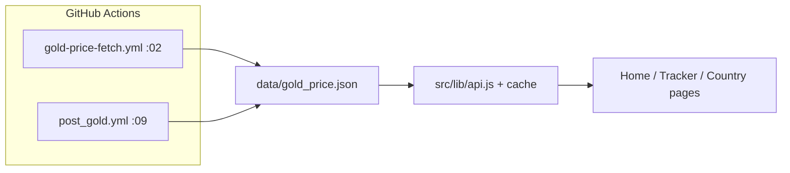
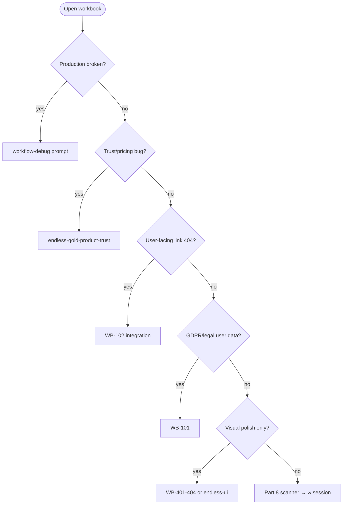
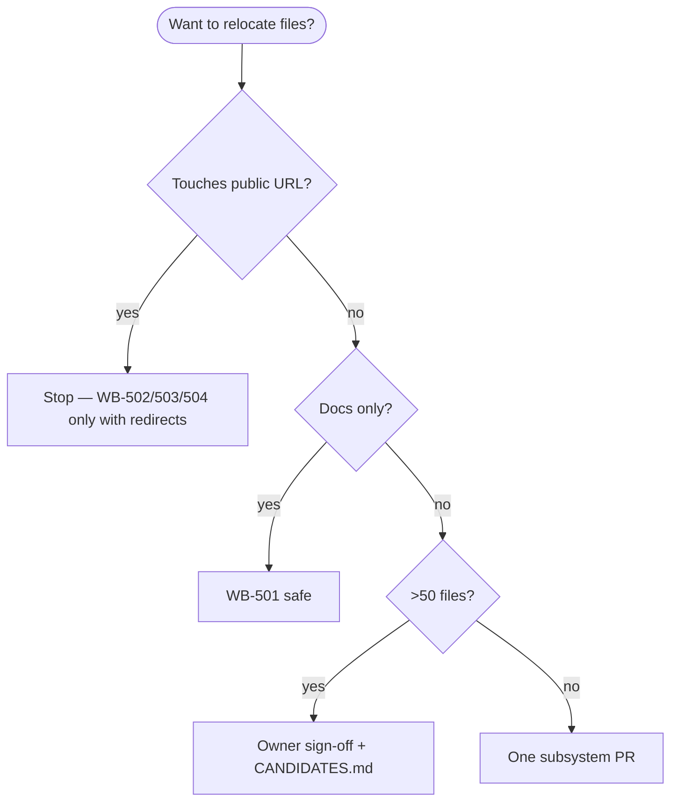

# Gold Ticker Live — Master Workbook

```yaml
workbook-version: "1.0.0"
status: canonical
owner: "@vctb12"
created: "2026-06-01"
last_verified_against_main: "2026-06-01"
production: "https://goldtickerlive.com/"
repo: "vctb12/GoldTickerLive"
tests_on_main: "1059 pass / 0 fail (npm test)"
```

> **This is the one document.** Everything else is reference, history, or a thin index pointing here.
> Agents: read **Part 0** (60 seconds), then **Part 6** (pick a session), then execute **Part 9**
> (verify). Humans: read **Part 1** (vision) and **Part 5** (gaps).
>
> **Composer one-liner:** `@.github/prompts/master-workbook-session.prompt.md`
>
> **Session log:** [`docs/workbook/WORKBOOK_SESSION_REGISTRY.md`](./workbook/WORKBOOK_SESSION_REGISTRY.md)

---

## Table of contents

| Part | Title |
| :--: | ----- |
| 0 | [How to use this workbook](#part-0--how-to-use-this-workbook) |
| 1 | [Product soul — amazing for gold](#part-1--product-soul--what-amazing-means-for-gold) |
| 2 | [Pricing & data truth (canonical)](#part-2--pricing--data-truth-canonical) |
| 3 | [Repository map (live)](#part-3--repository-map-live-snapshot) |
| 4 | [Surface registry & health](#part-4--surface-registry--health) |
| 5 | [Gap map (evidence-backed)](#part-5--gap-map-evidence-backed) |
| 6 | [Session catalog (all work)](#part-6--session-catalog--complete-work-queue) |
| 7 | [Decision trees](#part-7--decision-trees) |
| 8 | [Discovery scanners (never run out)](#part-8--discovery-scanners) |
| 9 | [Verification bible](#part-9--verification-bible) |
| 10 | [Production forbidden zone](#part-10--production-forbidden-zone) |
| 11 | [Consolidated backlog](#part-11--consolidated-backlog) |
| 12 | [Prompt & skill arsenal](#part-12--prompt--skill-arsenal) |
| 13 | [Mega session starter](#part-13--mega-session-starter-copy-paste) |
| A | [Appendix — doc authority map](#appendix-a--documentation-authority-map) |

**Thin indexes (do not duplicate this workbook):**

- [`PLAN.md`](../PLAN.md) — today's checklist only
- [`docs/REVAMP_PLAN.md`](./REVAMP_PLAN.md) — historical narrative + section checklists
- [`docs/plans/2026-06-01_master-operations-hub.md`](./plans/2026-06-01_master-operations-hub.md) — short routing summary → **prefer this workbook**

---

## Part 0 — How to use this workbook

### The contract (every session)

1. Read [`AGENTS.md`](../AGENTS.md) guardrails (pricing truth, EN/AR, DOM safety, PR-only).
2. Open [`PLAN.md`](../PLAN.md) and [`WORKBOOK_SESSION_REGISTRY.md`](./workbook/WORKBOOK_SESSION_REGISTRY.md).
3. Pick **one** session from [Part 6](#part-6--session-catalog--complete-work-queue) (or run [Part 8](#part-8--discovery-scanners) to mint a micro-session).
4. Branch: `cursor/wb-<id>-<slug>-cb21` (e.g. `cursor/wb-102-cross-page-deeplinks-cb21`).
5. Check open PRs: `gh pr list --state open` — no duplicate scope.
6. Implement the **smallest** change that satisfies the session acceptance criteria.
7. Run [Part 9](#part-9--verification-bible) commands for your track.
8. Update `PLAN.md`, workbook registry row, and any program checklist touched.
9. PR body: **What / Why / How / Proof / Risks**.

### What “done” means for Gold Ticker Live

| Level | Meaning |
| ----- | ------- |
| **Shipped** | Merged to `main`, CI green, guardrails intact |
| **Honest** | Freshness labels visible; reference ≠ retail |
| **Fast** | Repeat visit shows cached/skeleton path, not blank `—` |
| **Global** | EN + AR via `translations.js`; RTL at 360px |
| **Maintainable** | No new `innerHTML` sinks; tokens over hex |

### Programs already merged (do not re-do)

| Program | Status | PRs |
| ------- | ------ | --- |
| UI/UX audit Sessions 0–5 | 🟢 complete | [#387](https://github.com/vctb12/GoldTickerLive/pull/387)–[#393](https://github.com/vctb12/GoldTickerLive/pull/393) |
| 12-phase platform (backend, billing, API, …) | 🟢 largely landed | See [`docs/audits/12_PHASE_IMPLEMENTATION_SCORECARD.md`](./audits/12_PHASE_IMPLEMENTATION_SCORECARD.md) |

**Your job now:** close **integration gaps**, **product focus** (page sprawl), **vendor/GDPR**, and **terminal-grade UX** on flagship surfaces.

---

## Part 1 — Product soul — what “amazing” means for gold

### One sentence

**Gold Ticker Live is the bilingual GCC gold reference terminal** — spot-linked prices with honest
labels, tools for buyers and researchers, and a directory that never pretends to be a shop quote.

### Who we serve

| Persona | Job to be done | Flagship surfaces |
| ------- | -------------- | ----------------- |
| **UAE / GCC buyer** | “What is 22K per gram right now, and is today high or low?” | Home, tracker, country/city `gold-rate` |
| **Researcher / diaspora** | Compare countries, understand peg and karat purity | Compare, methodology, learn |
| **Shop visitor** | Find a market; understand reference vs retail before visiting | Shops, buying guides, calculator |
| **Returning user** | Alerts, watchlist, saved calcs | Tracker, dashboard (auth) |
| **Operator** | Post hourly price, moderate listings, watch providers | Actions, admin, X automation |

### Competitive bar (behavioral, not brand)

| They lead with… | We must lead with… |
| --------------- | ------------------ |
| Raw numbers above the fold | **Labeled** reference gram prices + timestamp + source + state |
| Single-purpose price pages | **Terminal**: tracker + tools + GCC context in one brand |
| Thin SEO farms | **Fewer, richer** indexable URLs; noindex the template farm |
| Generic finance chrome | **Dark/gold** premium dashboard; Arabic that reads naturally |

### Five pillars (non-negotiable)

1. **Truth** — Spot/reference ≠ retail. Making charges, VAT, and shop premiums are disclosed.
2. **Freshness** — Every visible price has source, timestamp, and state (`live` / `cached` / `fallback` / …).
3. **Speed** — Cache-first hydration; skeletons; no naked `Loading…` on flagship pages.
4. **Locale** — Full EN/AR; RTL at 360px; tabular nums for prices.
5. **Depth** — Methodology, learn, insights, calculator, compare — all subordinate to **live price truth**.

### What we refuse to become

- A jewelry e-commerce site or “buy now” funnel without disclaimers
- An LLM price oracle without “reference estimate” labeling
- A 600-page thin template farm that outranks our flagship URLs
- An SPA rewrite without owner program approval

---

## Part 2 — Pricing & data truth (canonical)

### Formula (do not change without owner approval)

```text
price_per_troy_ounce_USD = XAU_USD_spot
price_per_gram_USD       = price_per_troy_ounce_USD / 31.1034768
price_per_gram_AED (24K) = price_per_gram_USD × 3.6725
price_per_gram_AED (K)   = price_per_gram_AED (24K) × purity_factor[K]
price_per_gram_LOCAL     = price_per_gram_USD × FX(USD→local)   # NOT via AED peg
```

| Constant | Value | File |
| -------- | ----- | ---- |
| Troy oz → g | `31.1034768` | `src/config/constants.js` |
| AED peg | `3.6725` (fixed) | `src/config/constants.js` |
| Karat factors | 24K–9K | `src/config/karats.js` **only** |

### Data path (production)



| Stage | Source of truth |
| ----- | ---------------- |
| Committed spot | `data/gold_price.json` (workflow) |
| Client refresh | `src/lib/api.js`, `src/lib/cache.js` |
| Optional API | `GET /api/v1/prices/latest` (`server/routes/api-v1.js`) |
| FX | open.er-api.com (client); label timestamp in UI |

**Deep dive:** [`docs/freshness-contract.md`](./freshness-contract.md), [`.github/instructions/gold-pricing.instructions.md`](../.github/instructions/gold-pricing.instructions.md)

---

## Part 3 — Repository map (live snapshot)

Verified 2026-06-01 on `main` (excluding `node_modules/`, `dist/`).

| Path | Role | Agent notes |
| ---- | ---- | ----------- |
| `/*.html` (17) | Public entry pages | Do not bulk-move without C1 program |
| `src/pages/` | Page boot scripts | One module per flagship page |
| `src/components/` | Nav, footer, ticker, spotBar, charts | Shared chrome |
| `src/lib/` | api, cache, safe-dom, formatters | **safe-dom.js** for sinks |
| `src/config/` | translations, karats, countries, constants | All UI strings |
| `src/tracker/` | Tracker submodules | Flagship complexity |
| `styles/global.css` + `styles/partials/` | Tokens + split CSS | Post–Session 5 partials |
| `countries/` (~256 `index.html`) | Generated geo SEO | Generator-only edits |
| `content/` (~33) | Guides, tools, submit-shop | Content hub |
| `data/` | `gold_price.json`, shops JSON | **gold_price.json** = production |
| `server/` + `server.js` | Express `/api/v1/*` | JWT admin + public API |
| `admin/` | Operator UI shell | Supabase OAuth |
| `scripts/node/` | validate, SEO, sitemap, build | CI gates |
| `scripts/python/` | fetch, post, spike, newsletter | `sys.path` → `utils.*` |
| `.github/workflows/` (21) | CI, deploy, hourly gold/X | See Part 10 |
| `tests/` (1059 tests) | node:test + e2e | Set JWT env vars |
| `docs/` | Reference + **this workbook** | |
| `reports/` | Point-in-time audits | Regenerate, don't hand-edit scores |

### Root HTML inventory (17)

`index`, `tracker`, `calculator`, `compare`, `shops`, `learn`, `insights`, `invest`, `methodology`,
`pricing`, `developer`, `dashboard`, `account`, `privacy`, `terms`, `404`, `offline`

---

## Part 4 — Surface registry & health

Legend: 🟢 strong · 🟡 usable debt · 🔴 gap · ⚪ verify on device

| Surface | Purpose | Health | Primary files |
| ------- | ------- | :----: | ------------- |
| Homepage | Live snapshot, GCC grid, tools | 🟡 | `index.html`, `src/pages/home.js` |
| Tracker | Flagship terminal | 🟡 dense mobile | `tracker.html`, `src/pages/tracker-pro.js` |
| Calculator | 5-tab reference tools | 🟢 | `calculator.html`, `src/pages/calculator.js` |
| Compare | Cross-country retail estimate | 🟢 | `compare.html`, `src/pages/compare/` |
| Shops | Directory + map + compare | 🟡 vendor gap | `shops.html`, `src/pages/shops.js` |
| Learn | Education | 🟢 post Session 2 | `learn.html` |
| Insights | Market analysis feed | 🟢 BUILD 8 | `insights.html`, `src/pages/insights.js` |
| Invest | Planner | 🟡 strategy | `invest.html` — see page cleanup doc |
| Methodology | Trust anchor | 🟢 | `methodology.html` |
| Country/city | Geo SEO + rates | 🟡 sprawl | `countries/**`, `countries/country-page.js` |
| Pricing | Stripe tiers | 🔴 keys | `pricing.html`, `server/routes/stripe.js` |
| Dashboard | Auth user hub | 🟡 GDPR | `dashboard.html`, `public-accounts.js` |
| Developer | API keys | 🟢 | `developer.html` |
| Admin | Operations | 🟢 | `admin/*`, `server/routes/admin/` |
| X hourly post | Public channel | 🟢 | `post_gold.yml`, `scripts/python/` |

**Stakeholder summary:** [`docs/audits/STAKEHOLDER_READINESS_MATRIX.md`](./audits/STAKEHOLDER_READINESS_MATRIX.md)  
**Integration matrix:** [`docs/audits/INTEGRATION_REALITY_CHECK.md`](./audits/INTEGRATION_REALITY_CHECK.md)  
**Page cleanup (660 HTML):** [`docs/audits/PAGE_CLEANUP_AND_PRODUCT_FOCUS.md`](./audits/PAGE_CLEANUP_AND_PRODUCT_FOCUS.md)

---

## Part 5 — Gap map (evidence-backed)

Priority: **P0** ship blocker · **P1** major · **P2** cleanup · **P3** polish

| ID | Gap | P | Evidence | Session |
| -- | --- | - | -------- | ------- |
| G-01 | No GDPR export/delete UI + routes | P1 | `STAKEHOLDER_READINESS` §2; `NEXT_PR_SEQUENCE` PR1 | WB-101 |
| G-02 | No vendor portal (DB exists) | P1 | `INTEGRATION_REALITY_CHECK`; 0 vendor HTML | WB-701+ |
| G-03 | ~608 country HTML — thin per-karat farm | P2 | `PAGE_CLEANUP` | WB-201 |
| G-04 | Stripe checkout inert (no live keys) | P1 | `pricing.html`, owner secrets | Owner |
| G-05 | Alerts need `ALERT_JOB_TOKEN` + Resend | P1 | `docs/ALERTS_AND_NOTIFICATIONS.md` | WB-801 |
| G-06 | Mixed price history sources | P2 | `tracker-chart-loader` + baseline JSON | WB-802 |
| G-07 | 565 hardcoded hex in CSS | P2 | `PLAN.md` audit | WB-901 |
| G-08 | BUILD 7 shops — map polish incomplete | P2 | `PLAN.md` BUILD 7 | WB-301 |
| G-09 | BUILD 9 homepage — not final hero | P2 | `PLAN.md` BUILD 9 | WB-402 |
| G-10 | Content pages missing webpage-schema | P2 | `PLAN.md` pre-existing tests | WB-203 |
| G-11 | invest.html product focus unclear | P2 | `PAGE_CLEANUP` 🔴/noindex | WB-204 |
| G-12 | learn vs insights vs content/guides overlap | P2 | `PAGE_CLEANUP` 🟦 merge | WB-205 |
| G-13 | Cross-page deep links weak | P2 | Track D1 program | WB-102 |
| G-14 | Doc/plan sprawl confuses agents | P2 | 227+ `.md` files | WB-501 |
| G-15 | Vendor claim UI missing on shop pages | P2 | `shops-v1.js` claim route | WB-702 |

---

## Part 6 — Session catalog — complete work queue

Each session = **one PR**, one focus. Run in recommended order within a track; do not parallelize
conflicting files.

### Track Ω — Meta

| ID | Title | Prompt | Acceptance | Verify |
| -- | ----- | ------ | ---------- | ------ |
| WB-000 | Land master workbook | `master-workbook-session` | Workbook + registry + prompt index | Docs review |

### Track I — Integration & platform (highest leverage)

| ID | Title | Branch slug | Prompt / doc | Acceptance criteria |
| -- | ----- | ----------- | ------------ | ------------------- |
| WB-101 | GDPR export + delete | `wb-101-gdpr-export-delete` | `NEXT_PR_SEQUENCE` PR1 | `GET /api/v1/me/export`, `DELETE /api/v1/me`; dashboard EN/AR buttons; tests |
| WB-102 | Cross-page deep links | `wb-102-cross-page-deeplinks` | `endless-integration-wiring` + program D1 | Home→tracker hash; calc→shops; tracker→calc; all nav 200 |
| WB-103 | Tracker alerts surfacing | `wb-103-tracker-alerts-ux` | `tracker-flagship-revamp` (scoped) | Clear CTA from price card to alert create |
| WB-104 | Account data migration UX | `wb-104-dashboard-import-polish` | `backend-admin-supabase` | Import/export flows documented + tested |

### Track S — SEO & product focus

| ID | Title | Branch slug | Prompt | Acceptance |
| -- | ----- | ----------- | ------ | ---------- |
| WB-201 | Noindex stub karat pages | `wb-201-noindex-stub-plan` | `seo-noindex-governance` | Plan doc + noindex on ~400 stubs; sitemap shrink; validate green |
| WB-202 | Canonical country URLs audit | `wb-202-country-canonical` | program C2a | Generator-only 301 map; sitemap regen |
| WB-203 | Content webpage-schema sweep | `wb-203-content-schema` | `seo-noindex-governance` | Fix failing `audit-content-pages` tests |
| WB-204 | Invest page decision | `wb-204-invest-strategy` | program Phase 2 decision | Rebuild **or** 301 + noindex; documented in PR |
| WB-205 | Knowledge hub consolidation plan | `wb-205-knowledge-hub-plan` | `PAGE_CLEANUP` | Single plan; no mass delete in same PR |

### Track P — Product builds (remaining BUILD catalog)

| ID | Title | Branch slug | Acceptance |
| -- | ----- | ----------- | ---------- |
| WB-301 | BUILD 7 — shops map + cards | `wb-301-shops-build7` | Map lazy-load; compare bar; honest empty states |
| WB-302 | BUILD 9 — homepage hero terminal | `wb-302-home-hero` | One hero price; sparkline/context; 360px RTL |
| WB-303 | BUILD 10 — alerts server bridge | `wb-303-alerts-server` | Wire server alerts where token exists; docs for owner keys |

### Track V — Visual & UX (post audit)

| ID | Title | Branch slug | Prompt |
| -- | ----- | ----------- | ------ |
| WB-401 | Nav terminal polish | `wb-401-nav-terminal` | UI program B1 |
| WB-402 | Homepage 5-section consolidation | `wb-402-home-sections` | UI program B2 |
| WB-403 | Tracker 3-group modes | `wb-403-tracker-groups` | UI program B3 |
| WB-404 | Global interaction rollout | `wb-404-hover-reveal` | UI program B4 + `endless-ui-visual-sweep` |

### Track R — Repository & docs

| ID | Title | Branch slug | Doc |
| -- | ----- | ----------- | --- |
| WB-501 | Docs archive C1a | `wb-501-docs-archive` | `repo-reorganization-program` C1a |
| WB-502 | CSS co-location pilot C1c | `wb-502-css-colocate` | owner approval |
| WB-503 | HTML pilot 404/offline C1e | `wb-503-html-pilot` | redirects checklist |
| WB-504 | CI: SW precache + content audit | `wb-504-ci-gates` | program C3a |

### Track M — Monetization

| ID | Title | Prompt |
| -- | ----- | ------ |
| WB-601 | AdSense collapse audit | `endless-monetization-growth` |
| WB-602 | GA4 event parity | `docs/ANALYTICS_EVENTS.md` + `endless-monetization-growth` |
| WB-603 | Pricing page honest CTAs | No fake checkout; link to owner setup doc |

### Track A — AI (gated)

| ID | Title | Prompt |
| -- | ----- | ------ |
| WB-701 | AI disclaimer copy EN/AR | `endless-ai-integration` |
| WB-702 | AI drafts admin UI smoke | `backend-admin-supabase` |
| WB-703 | Newsletter commentary templates | pure functions + tests only |

### Track T — Trust (run anytime)

| ID | Title | Prompt |
| -- | ----- | ------ |
| WB-801 | Freshness label sweep | `endless-gold-product-trust` |
| WB-802 | Provider attribution consistency | `endless-gold-product-trust` |
| WB-803 | Karat inline factor purge | `pricing-data-audit` |

### Track ∞ — Endless (one fix per run)

Use when no WB-ID fits — still log row in registry as `WB-∞-<date>-<n>`.

| Scanner | Prompt file |
| ------- | ----------- |
| Repo | `endless-repo-discovery.prompt.md` |
| UI | `endless-ui-visual-sweep.prompt.md` |
| Frontend | `endless-frontend-polish.prompt.md` |
| Backend | `endless-backend-hardening.prompt.md` |
| Integration | `endless-integration-wiring.prompt.md` |
| Monetization | `endless-monetization-growth.prompt.md` |
| AI | `endless-ai-integration.prompt.md` |
| Docs | `endless-docs-governance.prompt.md` |
| Trust | `endless-gold-product-trust.prompt.md` |
| Pick next | `session-pick-next-work.prompt.md` |

**Recommended next 3 sessions:** WB-102 → WB-101 → WB-501

---

## Part 7 — Decision trees

### “What should I work on?”



### “Can I move files?”



---

## Part 8 — Discovery scanners

Run **one** scanner per endless session; fix the **first** hit not fixed on `main` in 7 days.

### S1 — Placeholder & loading text

```bash
rg -n 'Loading\.\.\.|Loading freshness|Preparing\.\.\.|Connecting\.\.\.' \
  --glob '*.{html,js}' --glob '!node_modules' --glob '!dist'
```

### S2 — Hardcoded user-visible English

```bash
rg -n ">[A-Z][a-z]+ [a-z]+" index.html tracker.html shops.html \
  --glob '!node_modules'
# Then confirm string exists in src/config/translations.js
```

### S3 — Karat factor outside config

```bash
rg -n '0\.9167|0\.875|0\.750|0\.5833' src --glob '!**/karats.js' --glob '!**/tests/**'
```

### S4 — Broken internal links (sample)

```bash
node scripts/node/check-internal-links.js 2>/dev/null || \
  rg -o 'href="(/[^"]+)"' -r '$1' index.html | head -40
```

### S5 — Missing freshness markup

```bash
rg -l 'data-price|price-hero|spot' src/pages countries --glob '*.js' | head -20
# Manual: confirm freshness component on each
```

### S6 — DOM safety regression

```bash
npm run validate 2>&1 | rg -i 'unsafe-dom|innerHTML'
```

### S7 — Open plan drift

```bash
rg -n 'next_session: done|IN PROGRESS|Start Session 1' docs/plans PLAN.md
```

### S8 — Production workflow drift

```bash
rg -n 'schedule:|cron:' .github/workflows/post_gold.yml .github/workflows/gold-price-fetch.yml
```

---

## Part 9 — Verification bible

| Track | Required | Optional |
| ----- | -------- | -------- |
| **Frontend** | `npm test`, `npm run lint`, `npm run validate`, `npm run build` | RTL 360 manual; Playwright smoke |
| **Backend** | export `JWT_SECRET`, `ADMIN_PASSWORD`, `ADMIN_ACCESS_PIN`; `npm test` | `npm start` + curl `/api/v1/health` |
| **Docs only** | Link grep on edited `.md` | — |
| **Workflows** | `workflow_dispatch` dry_run | Read run logs |
| **SEO** | `npm run validate` (sitemap + seo-meta) | `reports/seo-audit.md` regen |
| **Country gen** | `npm run build`; sitemap parity tests | |

Before `npm test`:

```bash
rm -rf playwright-report/ test-results/
export JWT_SECRET="dev-secret-key-for-local-development-32chars"
export ADMIN_PASSWORD="admin-dev-password"
export ADMIN_ACCESS_PIN="123456"
```

**Honesty rule:** List commands run vs assumed in every PR.

---

## Part 10 — Production forbidden zone

Do **not** change in routine sessions without owner approval + plan entry + dry-run:

| Asset | Why |
| ----- | --- |
| `.github/workflows/post_gold.yml` | Hourly public X post |
| `.github/workflows/gold-price-fetch.yml` | Committed spot truth |
| `data/gold_price.json` | Live payload (workflow-owned) |
| `sw.js` | PWA cache / precache |
| `src/config/constants.js` | AED peg + troy ounce |
| `CNAME`, root `robots.txt` structure | SEO |

**Allowed:** docs, UI, new tests, additive API routes, noindex meta, redirects with checklist.

---

## Part 11 — Consolidated backlog

Single table — source rows from `PLAN.md`, audits, BUILD catalog. **Do not duplicate into new plan files.**

| Source | Item | WB / action |
| ------ | ---- | ----------- |
| PLAN | Track D1 integration | WB-102 |
| PLAN | NEXT_PR PR1 GDPR | WB-101 |
| PLAN | Repo C1a docs | WB-501 |
| PLAN | BUILD 7 shops map | WB-301 |
| PLAN | BUILD 9 homepage | WB-302 |
| PLAN | 565 hex → tokens | WB-901 (∞) |
| NEXT_PR | PR2 noindex | WB-201 |
| PAGE_CLEANUP | Per-karat noindex | WB-201 |
| STAKEHOLDER | Vendor portal | WB-701+ (program TBD) |
| INTEGRATION | Stripe keys | Owner |
| UI/UX B1–B4 | Visual tracks | WB-401–404 |

Update this table only when a WB session merges or scope changes.

---

## Part 12 — Prompt & skill arsenal

| Use case | First choice |
| -------- | ------------ |
| **Any session** | `@.github/prompts/master-workbook-session.prompt.md` |
| Pick work | `session-pick-next-work.prompt.md` |
| Deep catalog (50+) | `docs/GOLD_TICKER_LIVE_AGENT_PROMPTS.md` |
| Endless copy-paste | `docs/plans/2026-06-01_endless-session-prompts.md` |
| PR review | `pr-review.prompt.md` |
| Mobile/RTL | `mobile-ux-audit.prompt.md` |
| Pricing audit | `pricing-data-audit.prompt.md` |
| Cursor skills | `.cursor/skills/*/SKILL.md` |
| Trust subagent | `.cursor/agents/gold-trust-auditor.md` |

---

## Part 13 — Mega session starter (copy-paste)

```md
You are the lead product engineer for Gold Ticker Live (vctb12/GoldTickerLive).

READ (in order):
1. AGENTS.md
2. docs/GOLD_TICKER_LIVE_MASTER_WORKBOOK.md — Part 0, Part 5 (gaps), Part 6 (pick ONE session)
3. PLAN.md + docs/workbook/WORKBOOK_SESSION_REGISTRY.md

EXECUTE exactly ONE workbook session (e.g. WB-102) OR one Part 8 scanner → single fix:
- Branch: cursor/wb-<id>-<slug>-cb21
- Smallest correct diff; EN+AR via translations.js; safe-dom only
- Do not touch Part 10 forbidden zone

DISCOVERY: cite file:line or test name for the issue you fix.

VERIFY per workbook Part 9 for your track.

DELIVERABLES:
- Update WORKBOOK_SESSION_REGISTRY.md row
- Update PLAN.md
- PR: What / Why / How / Proof / Risks
```

---

## Appendix A — Documentation authority map

| Tier | Documents |
| ---- | --------- |
| **0 — Charter** | `AGENTS.md`, **this workbook** |
| **1 — Active checklist** | `PLAN.md`, `WORKBOOK_SESSION_REGISTRY.md` |
| **1 — Backlog narrative** | `docs/REVAMP_PLAN.md` |
| **2 — Programs** | `2026-06-01_ui-ux-audit-remediation-program.md`, `2026-06-01_repo-reorganization-program.md`, `NEXT_PR_SEQUENCE.md` |
| **3 — Audits (point-in-time)** | `docs/audits/*`, `docs/GOLD_TICKER_LIVE_LATEST_WEBSITE_STATE_AUDIT.md` |
| **4 — Archive candidates** | Landed `2026-05-29_*` plans → `docs/archive/2026-06/` when WB-501 runs |

Full index: [`docs/plans/ARCHIVE_AND_SUPERSESSION_INDEX.md`](./plans/ARCHIVE_AND_SUPERSESSION_INDEX.md)

---

## Workbook changelog

| Version | Date | Change |
| ------- | ---- | ------ |
| 1.0.0 | 2026-06-01 | Initial canonical workbook: gaps, 40+ WB sessions, scanners, verification, mega prompt |
