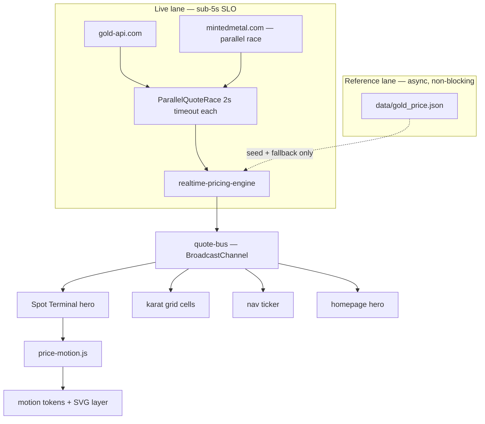

# Real-Time Tracker + Sitewide Revamp — 20-Phase Master Plan

```yaml plan-status
status: proposed
priority: P0
class: A
owner: @vctb12
created: 2026-06-05
supersedes-partially:
  - docs/plans/2026-04-24_tracker-redesign.md
  - docs/REVAMP_PLAN.md §7 Track D (15-phase tracker continuation)
extends:
  - docs/REVAMP_PLAN.md §22b (tracker/home/admin 30-phase)
guardrails_reviewed: true
```

**User goal:** Spot price must feel **real-time** — target **≤ 2 s typical refresh**, **≤ 5 s hard
ceiling** before the UI honestly degrades (cached/delayed/fallback). Better **animations and
graphics** for how spot is shown and updated. **Revamp `tracker.html` architecture** and align the
**whole site** to the same live data + motion layer.

**Non-negotiables (AGENTS.md §6):**

- Reference ≠ retail; freshness labels stay visible; AED peg `3.6725` fixed.
- Static multi-page architecture stays static (no SPA migration).
- EN/AR parity on every user-visible string (`src/config/translations.js`).
- No new `innerHTML` sinks; DOM-safety baseline must not regress.
- No secrets in git; no changes to `post_gold.yml` / `gold-price-fetch.yml` without owner review.

---

## Executive summary — why you still see 5–40 s gaps today

The repo already polls `gold-api.com` every **1 s** when that provider is active
(`src/lib/realtime-config.js`). The **5–40 s** experience comes from architecture, not a single
missing `setInterval`:

| Bottleneck                                   | Where                                                                                              | Effect                                                                    |
| -------------------------------------------- | -------------------------------------------------------------------------------------------------- | ------------------------------------------------------------------------- |
| **Serial provider chain**                    | `ChainedQuoteProvider` tries gold-api → mintedmetal → JSON → last_gold_price **one after another** | Up to **4 s × N providers** on failures (~16 s worst case before backoff) |
| **Failure backoff**                          | `realtime-config.js` `backoffMs: [2k, 5k, 10k, 20k, 40k, 60k]`                                     | After errors, next poll waits **5–40 s**                                  |
| **Static provider poll cadence**             | `resolveProviderPollMs()` → 30–60 s for `minted_metal`, `primary-provider`, cache                  | When live API fails, UI **intentionally** slows to cron/static speed      |
| **Full `renderAll()` on every tick**         | `applyRealtimeSnapshot()` → `renderAll()`                                                          | Jank + missed frames; feels sluggish even when data is fresh              |
| **Weak motion feedback**                     | `pulseFreshness` throttled **90 s**; hero `countUp` exists but competes with full re-render        | User cannot _see_ sub-second updates                                      |
| **Monolithic `tracker.html` (~1,788 lines)** | All modes inlined in one HTML file                                                                 | Hard to lazy-load, hard to isolate live hero fast path                    |

**Strategic fix:** Split **live lane** (sub-5 s SLO) from **reference lane** (hourly JSON / LBMA).
Never let a static fallback slow the hero poll loop.

---

## Target SLO (product contract)

| Metric                                      | Target                            | On breach                                |
| ------------------------------------------- | --------------------------------- | ---------------------------------------- |
| Time to first live quote (warm tab)         | ≤ 2 s p95                         | Show skeleton + "Connecting…"            |
| Refresh interval (market open, tab visible) | **1 s poll**, **≤ 2 s p95** apply | —                                        |
| Max age labelled **Live**                   | **5 s**                           | Auto-downgrade to Cached/Delayed         |
| Max wall-clock before honest degraded state | **5 s**                           | Show last price + explicit badge         |
| Hidden tab recovery                         | ≤ 2 s after `visibilitychange`    | Immediate `refreshNow` (already partial) |
| Animation frame budget per tick             | ≤ 8 ms JS on hero path            | Partial DOM update only                  |

Instrumentation already exists in `createRealtimePricingEngine()` (`p95RefreshIntervalMs`,
`p95ApplyLatencyMs`, SLO flags). Phase 1 wires these to visible debug + CI gates.

---

## Architecture target (end state)



### `tracker.html` new shape

| Layer                        | Responsibility                                                                                             |
| ---------------------------- | ---------------------------------------------------------------------------------------------------------- |
| `tracker.html`               | **Shell only** (~120 lines): meta, critical CSS, `#tracker-app`, empty mount roots, `<template>` fragments |
| `src/tracker/shell/mount.js` | Hydrates regions from templates; preserves frozen hash contract                                            |
| `src/tracker/shell/regions/` | `hero.js`, `live-desk.js`, `chart.js`, `modes/*.js` — one file per region                                  |
| `src/tracker/render.js`      | Becomes thin dispatcher → `renderHeroFast()` vs `renderModeSlow()`                                         |
| `styles/pages/tracker/`      | Split CSS: `_shell.css`, `_hero-terminal.css`, `_live.css`, `_compare.css`, …                              |

**Frozen:** URL hash schema (`docs/tracker-state.md`), mode order (`src/tracker/modes.js`), DOM IDs
consumed by tests (`tests/tracker-dom.test.js`).

---

## 20 phases

Each phase = **1–3 focused PRs**, reversible commit, checklist in `REVAMP_PLAN.md` §22b or new
subsection, verification block at bottom.

---

### Phase 1 — Real-time baseline & SLO instrumentation

**Goal:** Measure truth before changing behavior.

**Work:**

- [ ] Add `?debugSlo=1` panel (extends existing `debugFreshness`) showing: active provider,
      `p95RefreshIntervalMs`, `p95ApplyLatencyMs`, `nextPollInMs`, consecutive failures.
- [ ] Log structured `REALTIME_SLO` events to analytics (no PII): refresh interval, provider id,
      freshness state transitions.
- [ ] Capture baseline report: `reports/baseline-2026-06/realtime-slo.json` (30 min session script
      or manual matrix).
- [ ] Document current p50/p95 in this plan's "Evidence" section after first run.

**Files:** `src/components/RealtimeSlaPanel.js`, `src/lib/realtime-pricing-engine.js`,
`src/lib/analytics.js`, `tests/realtime-slo.test.js`

**Done when:** Baseline numbers recorded; SLO panel visible in debug mode; no production behavior
change.

---

### Phase 2 — Live lane: parallel race provider (kill the 16 s waterfall)

**Goal:** Worst-case live fetch ≤ **5 s**; typical ≤ **2 s**.

**Work:**

- [ ] New `ParallelQuoteRaceProvider` in `src/lib/quote-providers/parallel-race-provider.js`:
  - Race `gold-api.com` + `mintedmetal.com` with **2 s** timeout each (configurable).
  - First valid quote wins; abort losers.
  - Tag winner `providerPathSuccessful: true`.
- [ ] Replace serial chain in `createPrimaryQuoteProvider()`:
  - **Live race** → on total failure → **single** fast JSON read (`PrimaryQuoteProvider`, 1.5 s cap)
    → `LastGoldPriceQuoteProvider` → `SecondaryQuoteProvider` (cache).
- [ ] Cap **end-to-end** live-lane budget at **5 s** (`Promise.race` with master timer).
- [ ] Tests: simulated slow provider A + fast B → B wins in < 2 s; both fail → fallback within 5 s.

**Files:** `create-providers.js`, `chained-provider.js` (keep for non-live), new parallel module,
`tests/quote-providers-race.test.js`

**Done when:** `p95RefreshIntervalMs` ≤ 5000 in local soak test with simulated primary failure.

---

### Phase 3 — Freshness policy aligned to 5 s "Live" ceiling

**Goal:** Never label stale data **Live**; user trust matches latency SLO.

**Work:**

- [ ] Update `FRESHNESS_POLICY.liveMaxAgeMs` from `10_000` → **`5_000`**
      (`src/lib/freshness-policy.js`).
- [ ] Align `LIVE_STALE_GUARD_MS` in engine (`10_000` → `5_000`).
- [ ] Update `getLiveFreshness()` / tracker copy keys for honest transitions: Live → Cached at 5 s →
      Delayed at 60 s.
- [ ] Bilingual strings in `translations.js`: `tracker.freshness.liveSub5s`, degraded explanations.
- [ ] Tests: `tests/freshness-policy.test.js`, `tests/tracker-freshness.test.js` updated.

**Guardrail:** Methodology link stays on hero; states remain visible (never hidden for aesthetics).

---

### Phase 4 — Polling & backoff tuned for real-time (failure-only delay)

**Goal:** **1 s** poll when healthy; backoff **caps at 5 s** (not 40 s) while tab visible and market
open.

**Work:**

- [ ] `REALTIME_POLLING_DEFAULTS`: `backoffMs: [1000, 2000, 3000, 5000]` — **max 5 s**.
- [ ] When `providerId === 'gold_api_com'` (or live race winner), force `livePollMs: 1000` even
      after single failure.
- [ ] Static/cache providers: keep 30–60 s **only** when live lane has been exhausted for ≥ 5 s
      (explicit `referenceMode` flag in snapshot).
- [ ] `hiddenPollMs`: 5 s (not 20 s) so background tabs recover quickly on focus.
- [ ] Remove `Math.max(CONSTANTS.GOLD_REFRESH_MS, 20000)` secondary timer conflation — wire/history
      on separate 60 s loop decoupled from spot poll (`tracker-pro.js` `startAutoRefresh`).

**Done when:** Visible tab + healthy API → countdown shows 1 s; after 3 failures → max 5 s
countdown, never 40 s.

---

### Phase 5 — `tracker.html` shell decomposition (architecture revamp)

**Goal:** Cut monolith; enable lazy mount + fast hero path.

**Work:**

- [ ] Extract static regions into `<template id="tp-tpl-hero">`, `tp-tpl-live-desk`,
      `tp-tpl-compare`, etc.
- [ ] `tracker.html` retains: trust banner slot, `#tracker-app`, template tags, single
      `type="module"` entry `src/pages/tracker-pro.js`.
- [ ] New `src/tracker/shell/mount-templates.js` clones templates into mount points on `init()`.
- [ ] **Preserve all existing element IDs** used in tests (compatibility shim document in
      `docs/tracker-state.md`).
- [ ] Move hard-coded EN trust copy to `translations.js` (already partially done in JS — finish HTML
      stragglers).

**Files:** `tracker.html`, new `src/tracker/shell/*`, `tests/tracker-dom.test.js`,
`tests/e2e/tracker-flow.spec.js`

**Done when:** `tracker.html` < 400 lines; all tracker DOM tests green; no hash contract change.

---

### Phase 6 — Spot Terminal hero (graphics + layout)

**Goal:** Flagship visual for XAU/USD — readable, animated, trustworthy.

**Work:**

- [ ] New region component `src/tracker/shell/spot-terminal.js` +
      `styles/pages/tracker/_hero-terminal.css`.
- [ ] **Layout tiers:**
  1. **Primary:** Giant tabular XAU/USD + per-gram selected karat/currency
  2. **Secondary:** Day change strip, session high/low (from wire/history)
  3. **Tertiary:** Badges row (freshness, source, market open)
- [ ] **Graphics (CSS + inline SVG, no new deps):**
  - Animated gold **pulse ring** behind price (`@keyframes spot-ring-breathe`, reduced-motion off)
  - **Tick tape** SVG strip (scrolling last N price deltas, 1 px line chart)
  - **Live dot** with sonar ripple when `freshness.state === 'live'`
- [ ] Collapse redundant hero stats on mobile → single terminal + swipeable karat chips.
- [ ] EN/AR: mirror ripples/chevrons in RTL; Arabic-Indic numerals via existing formatters.

**Done when:** Before/after screenshots 360 px + 1440 px; Lighthouse LCP not worse than baseline.

---

### Phase 7 — Price motion system (site-wide primitive)

**Goal:** Every price update **looks** like an update.

**Work:**

- [ ] New `src/lib/price-motion.js`:
  - `animatePrice(el, from, to, { duration, direction })` — wraps `countUp` + flash
  - `pulseSpotTerminal(root)` — orchestrates ring + digit emphasis
  - `tickFreshnessPill(el)` — **per successful poll** throttle (3 s min, not 90 s) for hero badge
    only
- [ ] CSS in `styles/global.css`: `--duration-price-tick`, `--ease-price-tick`,
      `[data-price-flash="up|down"]` enhancement (digit-level color wash).
- [ ] Optional **odometer** mode for hero (`data-motion="odometer"`) using CSS `transform` per digit
      column (no canvas lib).
- [ ] `prefers-reduced-motion`: instant swap + border flash only.

**Adoption order:** tracker hero → karat table → homepage hero → nav ticker.

**Files:** `price-motion.js`, `hero.js`, `home.js`, `tests/price-motion.test.js`

---

### Phase 8 — Fast render path (stop full `renderAll()` on every poll)

**Goal:** Sub-16 ms hero update on each quote.

**Work:**

- [ ] Split `renderAll()` → `renderLiveTick({ spot, freshness })` (hero, badges, xau chip, karat
      prices) vs `renderWorkspace()` (chart, compare, archive).
- [ ] `applyRealtimeSnapshot()` calls **only** `renderLiveTick` + `renderTrackerAddonPanels`
      (SLA/freshness).
- [ ] Debounce full `renderWorkspace()` to 250 ms or on user interaction (currency/karat change).
- [ ] `requestAnimationFrame` batching for DOM writes in hero path.

**Done when:** Performance trace shows < 5 ms script on poll tick (excl. network).

---

### Phase 9 — Sticky command deck + mobile architecture

**Goal:** Controls always reachable; hero stays uncluttered.

**Work:**

- [ ] Single **sticky command deck**: language, currency, karat, unit, refresh, share — merges hero
      controls + mode toolbar (`REVAMP_PLAN` §7 Phase 3).
- [ ] Mobile: bottom **safe-area** dock (44 px targets) with expand sheet for selectors.
- [ ] `position: sticky` offsets account for nav + spot ticker (`env(safe-area-inset-*)`).
- [ ] Keyboard shortcuts preserved (`K`, `U`, `R`, registry from `modes.js`).

**Files:** `tracker.html` templates, `tracker-pro.css` → `_command-deck.css`, `control-shortcuts.js`

---

### Phase 10 — Chart sync with live tick

**Goal:** Chart feels connected to the same stream.

**Work:**

- [ ] Append **live last-price dot** on chart edge (lightweight-charts API — no lib swap).
- [ ] On each `renderLiveTick`, update crosshair legend without full chart rebuild.
- [ ] Range pills: crossfade transition (`data-range-transition`) already partial — finish for
      1D/1W/1M.
- [ ] Touch: `touch-action: pan-y` on chart container; pinch only inside chart bounds.
- [ ] Stale chart overlay when freshness ≠ live (explicit banner, not blank).

---

### Phase 11 — Karat grid + markets live binding

**Goal:** All visible prices move together within one frame.

**Work:**

- [ ] Karat `<tbody>`: cell-level `animatePrice` (already partial in `hero.js` — extend).
- [ ] Markets grid cards: subscribe to quote bus; remove duplicate `fetchGold` calls.
- [ ] Sticky karat header + `scope="col"` accessibility (`REVAMP_PLAN` §7 Phase 6).
- [ ] Tap-to-copy row with haptic-style micro-animation (`copy-toast`).

---

### Phase 12 — Homepage real-time parity

**Goal:** Landing page feels as live as tracker.

**Work:**

- [ ] Extract shared `initSitewideQuoteBus()` from tracker init — singleton engine on `index.html`.
- [ ] Homepage `#hero-live-card` uses `SpotTerminal` **compact** variant (shared CSS partial).
- [ ] GCC karat strip: `countUp` + directional flash on bus events.
- [ ] Replace 30 s freshness text timer with bus-driven updates + 1 s age tick.

**Files:** `src/pages/home.js`, `index.html`, `styles/pages/home.css`,
`tests/home-freshness.test.js`

---

### Phase 13 — Global chrome: nav ticker + cross-page quote bus

**Goal:** One engine, many surfaces.

**Work:**

- [ ] `src/lib/quote-bus.js` — wraps engine singleton; `subscribe(cb)` / `getSnapshot()`.
- [ ] `BroadcastChannel('gtl-quotes')` so tracker ↔ calculator tabs share last quote (optional
      enhancement).
- [ ] `src/components/ticker.js` animates on bus events (marquee pause on update flash).
- [ ] Footer freshness micro-line on flagship pages.

**Constraint:** GitHub Pages static — bus is client-only; no WebSocket requirement in this phase.

---

### Phase 14 — Calculator, shops, country pages (live hooks, not live clones)

**Goal:** Consistent numbers without N× polling.

**Work:**

- [ ] Calculator result card: read bus snapshot on load; manual refresh button hits `refreshNow`.
- [ ] Shops grid: show reference spot timestamp from bus (not independent fetch).
- [ ] Country `page-hydrator.js`: single bus subscribe for hero countUp.
- [ ] Document in methodology: country local FX still from `open.er-api.com` with own timestamp.

---

### Phase 15 — Tracker modes: lazy architecture

**Goal:** Compare / archive / exports load only when opened.

**Work:**

- [ ] Dynamic `import()` per mode: `src/tracker/modes/compare/index.js`, etc.
- [ ] `ui-shell.js` mounts empty `#tp-mode-compare` until first activation.
- [ ] Compare: `safe-dom` table (`REVAMP_PLAN` §22b Phase 10).
- [ ] Archive: pagination + hash sort (`Phase 11` from prior tracker plan).
- [ ] Preserve Playwright deep-link smoke per mode.

---

### Phase 16 — Alerts & planner overlay redesign

**Goal:** Overlays feel part of command center, not bolted-on modals.

**Work:**

- [ ] Slide-over panels with shared motion tokens (220 ms, matches nav drawer).
- [ ] Alerts: browser-only disclaimer + `aria-live` on trigger strip.
- [ ] Planner: retail vs reference toggle above fold; Zakat hash round-trip.
- [ ] Wire alert engine to quote bus (already partial) — verify ≤ 1 s eval latency after tick.

---

### Phase 17 — CSS architecture + motion tokens

**Goal:** Maintainable styles; delete dead rules.

**Work:**

- [ ] Split `tracker-pro.css` (~3,967 lines) into `styles/pages/tracker/*.css` imported from shell.
- [ ] Promote motion tokens to `styles/global.css`: `--motion-spot-ring`, `--motion-tick-flash`.
- [ ] Remove duplicate hero/badge rules after Spot Terminal lands.
- [ ] Stylelint pass; no hard-coded hex where token exists.

---

### Phase 18 — Performance & PWA hardening

**Goal:** Fast first paint; honest caching.

**Work:**

- [ ] `modulepreload` only shell + quote-bus; defer chart bundle until live desk visible.
- [ ] `IntersectionObserver` for below-fold sections (wire, archive teaser).
- [ ] `sw.js`: **never** cache `api.gold-api.com`, `/api/v1/prices/latest`, or `gold_price.json`
      with stale-while-revalidate for live paths.
- [ ] Lighthouse: mobile LCP ≤ 2.8 s (baseline in `reports/baseline-2026-05/`).

---

### Phase 19 — Optional backend quote relay (Express edge)

**Goal:** Reduce browser CORS/rate-limit pain; path to SSE later.

**Work (owner-approved, not required for Phase 1–18):**

- [ ] `GET /api/v1/quotes/spot` — server-side fetch with edge cache **≤ 1 s**.
- [ ] Provider adapter reuses `scripts/python` validation bands.
- [ ] Feature flag `?provider=relay` in create-providers.
- [ ] **Do not** blur reference vs retail in API responses.

**Skip if:** gold-api.com race stays < 2 s p95 after Phase 2–4.

---

### Phase 20 — CI SLO gates, monitoring, launch verification

**Goal:** Regressions caught before merge.

**Work:**

- [ ] `tests/realtime-slo.test.js` — engine metrics flags when p95 refresh > 5 s (mock clock).
- [ ] Playwright: open tracker → wait for `#tp-xauusd-value` non-empty → second update within 5 s
      (network permitting; mark optional in CI with recorded mock).
- [ ] `npm run validate` step: freshness policy consistency check.
- [ ] Pa11y mobile + RTL screenshot matrix (360 / 768 / 1440).
- [ ] Update `PLAN.md`, `REVAMP_PLAN.md` §22b, `docs/tracker-state.md` with final architecture
      diagram.
- [ ] Rollback playbook: flip `REALTIME_POLLING_DEFAULTS`, revert parallel provider, restore chained
      fallback.

**Done when:** All required CI green; owner sign-off on live SLO dashboard screenshot.

---

## Whole-site scope map (what each surface gets)

| Surface            | Real-time (Phase) | Motion (Phase) | Architecture (Phase)        |
| ------------------ | ----------------- | -------------- | --------------------------- |
| `tracker.html`     | 2–4, 8            | 6–8, 11        | 5, 9, 15–17                 |
| `index.html`       | 12–13             | 7, 12          | 13                          |
| `calculator.html`  | 14                | 7              | 14                          |
| `shops.html`       | 14                | 7              | —                           |
| `countries/*`      | 14                | 7              | —                           |
| Nav/footer ticker  | 13                | 7              | 13                          |
| `methodology.html` | —                 | —              | trust copy only             |
| Admin              | —                 | —              | out of scope (§22b Track 4) |

---

## Verification matrix (every phase)

```bash
export JWT_SECRET="dev-secret-key-for-local-development-32chars"
export ADMIN_PASSWORD="admin-dev-password"
export ADMIN_ACCESS_PIN="123456"

rm -rf playwright-report/ test-results/
npm test
npm run lint
npm run validate
npm run build
```

**Manual (tracker phases):**

1. Open `tracker.html?debugSlo=1` — confirm provider + countdown ≤ 1 s when healthy.
2. Throttle network to "Fast 3G" — confirm degraded badge within 5 s, not 40 s.
3. Toggle AR — RTL terminal layout + mirrored motion.
4. `prefers-reduced-motion: reduce` — no odometer, instant price swap.

---

## Risks & mitigations

| Risk                                       | Mitigation                                                         |
| ------------------------------------------ | ------------------------------------------------------------------ |
| gold-api.com rate limits                   | Parallel race + 2 s timeout; optional Phase 19 relay               |
| False "Live" label                         | Phase 3 policy + engine stale-live guard                           |
| DOM test breakage from template extraction | ID preservation shim; run `tests/tracker-dom.test.js` every commit |
| LCP regression from SVG terminal           | Lazy hero graphics; critical CSS inline ring only                  |
| Animation overload                         | Motion budget; reduced-motion path mandatory                       |
| Provider cost                              | Do not poll static JSON at 1 s — live lane only                    |

---

## Suggested PR sequence (first 5 slices)

1. **PR-A (Phases 1–4):** SLO panel + parallel race + 5 s policy + backoff cap — _fixes latency root
   cause_.
2. **PR-B (Phases 5–8):** tracker shell split + Spot Terminal + price-motion + fast render path.
3. **PR-C (Phases 9–11):** command deck + chart sync + karat binding.
4. **PR-D (Phases 12–14):** sitewide quote bus + homepage/calc/country hooks.
5. **PR-E (Phases 15–20):** lazy modes + CSS split + CI gates.

---

## Relationship to existing plans

- **Supersedes** latency-related assumptions in `docs/plans/2026-04-24_tracker-redesign.md` (Phases
  9, 16–18 motion items fold into Phases 6–8 here).
- **Extends** `REVAMP_PLAN.md` §22b — add subsection "Track 5 — Real-time SLO program" pointing to
  this file.
- **Does not replace** production workflow plans for `data/gold_price.json` cron — hourly commit
  remains SEO/social fallback, not the live hero source.

---

## Done checklist (program level)

- [ ] p95 refresh interval ≤ 5 s with tab visible (measured, recorded in `reports/`)
- [ ] User-visible "Live" never older than 5 s
- [ ] Spot Terminal shipped with motion + RTL
- [ ] `tracker.html` < 400 lines shell + templates
- [ ] Homepage hero uses same quote bus
- [ ] All §6 trust guardrails intact
- [ ] `npm test` + `validate` + `build` green
- [ ] Before/after evidence attached to final PR
