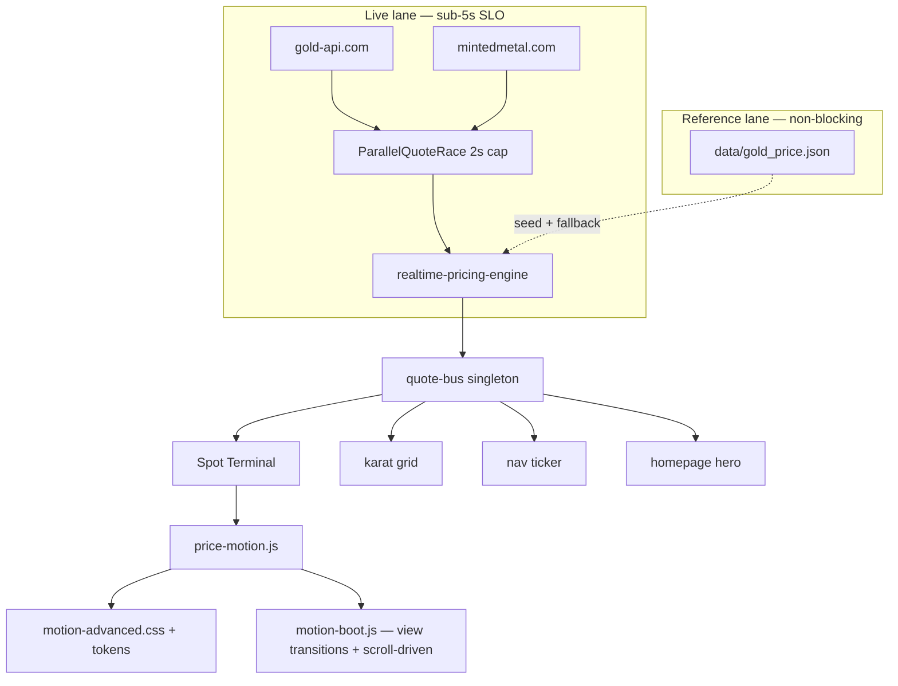

# Real-Time Tracker + Sitewide Motion Revamp — 20-Phase Master Plan

```yaml
plan-status: active
priority: P0
class: A
owner: @vctb12
created: 2026-06-09
supersedes:
  - docs/plans/2026-06-05_realtime-tracker-site-revamp-20-phase.md (latency core — retained as appendix)
extends:
  - docs/REVAMP_PLAN.md §22b Track 6 (new)
  - docs/plans/2026-05-30_visual-excellence-session7b.md
guardrails_reviewed: true
research:
  - GoldTrack.io (60s WebSocket cadence, multi-metal dashboard, normalize/compare charts)
  - Gold Bullion Stacker (2s streaming, lock-screen live activities, 3D stack viz)
  - Robinhood / prediction-market micro-interaction patterns (rolling counters, 200–400ms)
  - CSS scroll-driven animations + View Transitions API (2025–2026 compositor-thread motion)
  - Fintech 2026 UX (trust-through-transparency, event-driven UI, no anxiety flashes)
```

**User goal:** Gold Ticker Live must feel like a **living terminal** — sub-5 s honest live pricing,
Robinhood-grade price motion, and **animation everywhere it earns trust** (not decoration). Revamp
`tracker.html` architecture, wire a sitewide quote bus, and ship a cohesive **Motion Universe** that
works in EN + AR with `prefers-reduced-motion` fallbacks.

**Non-negotiables (AGENTS.md §6):** Reference ≠ retail; freshness labels never hidden; AED peg
`3.6725` fixed; static multi-page (no SPA); EN/AR via `translations.js`; DOM-safety baseline; no
secrets; `post_gold.yml` / `gold-price-fetch.yml` need owner review.

---

## Executive summary

### What competitors teach us

| Product | Motion / live pattern | What we adopt | What we reject |
| ------- | ---------------------- | ------------- | -------------- |
| **GoldTrack** | 60s WebSocket refresh; chart normalize + % change toggle; market-closed honest state | Live dot + chart edge dot; multi-range crossfade; honest closed banner | Paywall on prices |
| **Gold Bullion Stacker** | 2s streaming; lock-screen live activities; 3D stack visualization | Ambient pulse ring; tick tape strip; “always updating” affordance | 3D WebGL stack (perf cost on static GH Pages) |
| **Robinhood** | Rolling probability counters; 200–300ms eased number transitions | `countUp` + odometer columns; directional flash (muted green/red) | Aggressive red flashing on every tick |
| **2026 fintech UX** | Event-driven confirmations; progress indicators; personalization | Per-poll freshness micro-pulse; export/share receipt animation | Motion-only feedback (always pair with text) |

### Why the site still feels 5–40 s stale

The June 2025 plan diagnosis still holds — see
[`2026-06-05_realtime-tracker-site-revamp-20-phase.md`](./2026-06-05_realtime-tracker-site-revamp-20-phase.md)
for the bottleneck table. **Animation cannot fix wrong latency**; Phases 1–4 fix truth, Phases 5–20
make truth *visible* and *delightful*.

### Motion budget (2026 fast-site standard)

Every animation must have one of four jobs: **state**, **attention**, **feedback**, **spatial**.

| Rule | Value |
| ---- | ----- |
| Micro-interaction duration | 120–200 ms |
| Panel / page enter | 240–320 ms |
| Hero orchestration (first paint) | ≤ 800 ms total |
| Single animation max | 500 ms |
| Properties | `transform`, `opacity`, `filter` only on hot paths |
| Reduced motion | Opacity swap or instant state; never remove freshness text |
| INP target | < 200 ms on tracker controls |

---

## Target SLO (product contract)

| Metric | Target | On breach |
| ------ | ------ | --------- |
| Time to first live quote (warm tab) | ≤ 2 s p95 | Skeleton + “Connecting…” |
| Refresh interval (market open, visible tab) | 1 s poll, ≤ 2 s p95 apply | — |
| Max age labelled **Live** | **5 s** | Auto-downgrade to Cached/Delayed |
| Max wall-clock before degraded state | **5 s** | Last price + explicit badge |
| Hidden tab recovery | ≤ 2 s after `visibilitychange` | `refreshNow` |
| Hero tick JS budget | ≤ 8 ms per poll | Partial DOM only (`renderLiveTick`) |

---

## Architecture target



### `tracker.html` end state

| Layer | Responsibility |
| ----- | -------------- |
| `tracker.html` | Shell ~120 lines: meta, critical CSS, `#tracker-app`, `<template>` fragments |
| `src/tracker/shell/mount.js` | Hydrate regions; frozen hash contract |
| `src/tracker/shell/regions/` | `hero.js`, `live-desk.js`, `chart.js`, `modes/*.js` |
| `styles/pages/tracker/` | Split CSS: `_shell`, `_hero-terminal`, `_live`, `_compare`, … |

**Frozen:** `docs/tracker-state.md`, `src/tracker/modes.js`, `tests/tracker-hash.test.js`,
`tests/tracker-dom.test.js` element IDs.

---

## Motion Universe — sitewide animation catalog

Primitives ship in layers. **Phase 0** (this PR) lands foundation; later phases adopt per surface.

### Layer 0 — Foundation (Phase 0, shipped in PR-A)

| Primitive | Module / CSS | Surfaces |
| --------- | ------------ | -------- |
| `animatePrice()` | `src/lib/price-motion.js` | All price cells |
| `initMotionBoot()` | `src/lib/motion-boot.js` | Every page with nav |
| View Transitions | `motion-advanced.css` + boot | Same-origin nav clicks |
| Scroll-driven reveal | `@supports (animation-timeline: view())` | `[data-reveal-scroll]` |
| Spot ring breathe | `.spot-terminal--live` | Tracker + home hero |
| Live sonar dot | `.live-sonar` | Freshness pills when Live |
| Stagger children | `[data-stagger]` | Section grids |
| Motion tokens | `styles/partials/tokens.css` | Global |

### Layer 1 — Price terminal (Phases 6–8)

- CSS odometer columns (`data-motion="odometer"`) — per-digit `transform: translateY`
- Tick tape SVG — last 12 deltas, 1 px sparkline, scroll `@keyframes tick-tape`
- Directional digit wash — `[data-price-flash="up|down"]` on hero only
- Chart live edge dot — pulses on bus tick (no full chart rebuild)

### Layer 2 — Spatial & navigation (Phases 9, 13, 17)

- View Transition shared elements: hero price, nav logo, freshness pill (`view-transition-name`)
- Mode tab crossfade — existing `tab-panels--crossfade`, extend to tracker modes
- Mobile command deck slide-up sheet — `drawer-slide-in` + safe-area
- Breadcrumb trail fade — sequential 40 ms stagger

### Layer 3 — Content & trust (Phases 14–16)

- FAQ accordion height transition — `grid-template-rows: 0fr → 1fr` pattern
- Methodology formula step reveal — staggered `[data-reveal]` (exists; extend)
- Copy-toast particle burst — CSS radial gradient, 180 ms, no canvas
- Export receipt slide-in — “brief copied” card with source badge

### Layer 4 — Ambient polish (Phase 17–18)

- Reading progress bar — `animation-timeline: scroll()` on article pages
- Parallax hero mesh — subtle `transform: translateY` on scroll (opacity-only fallback)
- Skeleton shimmer — already in `skeleton.css`; unify duration tokens
- 404 freshness pill pulse — on cache read success

### Surfaces × motion intensity

| Surface | Real-time | Motion intensity | Key effects |
| ------- | --------- | ---------------- | ----------- |
| `tracker.html` | ●●● | ●●●●● | Spot terminal, tick tape, chart dot, karat row flash |
| `index.html` | ●●● | ●●●● | Compact terminal, GCC strip countUp, hero ring |
| `calculator.html` | ●● | ●●● | Purity ring, result countUp, tab crossfade |
| `shops.html` | ● | ●●● | Card hover-lift, grid `--updating` fade, copy ✓ |
| `countries/*` | ●● | ●●● | Hero countUp, karat copy micro-bounce |
| `compare.html` | ●● | ●●● | Bar chart grow, cheapest callout pulse |
| `insights.html` | ● | ●●● | Masonry reveal, pulse card countUp |
| `learn/methodology` | — | ●● | Guide card hover, formula stagger |
| Nav / ticker | ●●● | ●●●● | Marquee pause-flash on tick, view transitions |
| `404.html` | ● | ●● | Freshness pill, search focus ring expand |

---

## 20 phases

Each phase = 1–3 focused PRs, reversible commits, checklist synced to `REVAMP_PLAN.md` §22b Track 6.

---

### Phase 0 — Motion foundation (PR-A — **in progress**)

**Goal:** Shared motion layer every later phase imports.

**Work:**

- [x] `src/lib/price-motion.js` — `animatePrice`, `pulseSpotTerminal`, `tickFreshnessPill`
- [x] `src/lib/motion-boot.js` — view transitions + scroll-driven class + stagger scan
- [x] `styles/partials/motion-advanced.css` — spot ring, sonar, view-transition, scroll-driven
- [x] Motion tokens in `tokens.css` (`--motion-*`, `--duration-price-tick`)
- [x] Wire `initMotionBoot()` from `injectNav()` (once per page)
- [ ] Tests: `tests/price-motion.test.js`, `tests/motion-boot.test.js`

**Done when:** Tracker hero uses `animatePrice`; nav same-origin clicks crossfade; reduced-motion path verified.

---

### Phase 1 — Real-time baseline & SLO instrumentation

**Goal:** Measure truth before changing provider behavior.

**Work:**

- [ ] `?debugSlo=1` panel: provider, `p95RefreshIntervalMs`, `p95ApplyLatencyMs`, `nextPollInMs`
- [ ] Analytics `REALTIME_SLO` events (no PII)
- [ ] Baseline capture: `reports/baseline-2026-06/realtime-slo.json`
- [ ] Document p50/p95 in Evidence section below

**Files:** `RealtimeSlaPanel.js`, `realtime-pricing-engine.js`, `tests/realtime-slo.test.js`

---

### Phase 2 — Live lane: parallel race provider

**Goal:** Worst-case live fetch ≤ 5 s; typical ≤ 2 s.

**Work:**

- [ ] `ParallelQuoteRaceProvider` — race gold-api + mintedmetal, 2 s timeout each
- [ ] Replace serial chain in `createPrimaryQuoteProvider()`
- [ ] Master 5 s `Promise.race` budget
- [ ] Tests: slow A + fast B → B wins; both fail → fallback ≤ 5 s

---

### Phase 3 — Freshness policy: 5 s Live ceiling

**Goal:** Never label stale data Live.

**Work:**

- [ ] `FRESHNESS_POLICY.liveMaxAgeMs` → `5_000`
- [ ] `LIVE_STALE_GUARD_MS` → `5_000`
- [ ] Bilingual `tracker.freshness.*` keys for transitions
- [ ] Tests updated

---

### Phase 4 — Polling & backoff (failure-only delay)

**Goal:** 1 s poll when healthy; backoff caps at 5 s (not 40 s).

**Work:**

- [ ] `backoffMs: [1000, 2000, 3000, 5000]`
- [ ] `hiddenPollMs: 5000`
- [ ] Decouple wire/history 60 s loop from spot poll
- [ ] `referenceMode` flag when live lane exhausted

---

### Phase 5 — `tracker.html` shell decomposition

**Goal:** `tracker.html` < 400 lines; lazy mount roots.

**Work:**

- [ ] `<template id="tp-tpl-*">` fragments
- [ ] `src/tracker/shell/mount-templates.js`
- [ ] Preserve all test DOM IDs
- [ ] Finish HTML straggler i18n

---

### Phase 6 — Spot Terminal hero (graphics + motion)

**Goal:** Flagship XAU/USD terminal — readable, animated, trustworthy.

**Work:**

- [ ] `src/tracker/shell/spot-terminal.js` + `_hero-terminal.css`
- [ ] Layout: primary price / day-change strip / badges row
- [ ] Graphics: pulse ring, tick tape SVG, live sonar dot
- [ ] Mobile: swipeable karat chips; collapse redundant stats
- [ ] RTL: mirror ripples, Arabic-Indic numerals

**Motion:** Ring breathe 2.4 s loop when Live; sonar 1.8 s; tick tape 12 s linear scroll.

---

### Phase 7 — Price motion adoption (sitewide)

**Goal:** Every price update *looks* like an update.

**Work:**

- [ ] Replace direct `countUp` calls with `animatePrice` on flagship surfaces
- [ ] Odometer mode on tracker hero (`data-motion="odometer"`)
- [ ] `tickFreshnessPill` — 3 s throttle on hero badge (not 90 s)
- [ ] Adoption order: tracker → home → nav ticker → calculator → countries

---

### Phase 8 — Fast render path

**Goal:** Sub-16 ms hero update per poll.

**Work:**

- [ ] Split `renderAll()` → `renderLiveTick` + `renderWorkspace`
- [ ] `applyRealtimeSnapshot()` → live tick only
- [ ] Debounce full workspace render 250 ms
- [ ] `requestAnimationFrame` batch DOM writes

---

### Phase 9 — Sticky command deck + mobile dock

**Goal:** Controls always reachable; hero uncluttered.

**Work:**

- [ ] Merge hero controls + mode toolbar into sticky deck
- [ ] Mobile bottom dock + expand sheet (slide-up 280 ms)
- [ ] Safe-area offsets; keyboard shortcuts preserved

**Motion:** Deck shadow deepens on scroll (`scroll()` timeline); dock icon bounce on active mode.

---

### Phase 10 — Chart sync with live tick

**Goal:** Chart feels connected to the stream.

**Work:**

- [ ] Live last-price dot on chart edge
- [ ] Crosshair legend update without rebuild
- [ ] Range pill crossfade (finish 1D/1W/1M)
- [ ] Stale chart overlay when freshness ≠ live

**Motion:** Dot scale pulse 200 ms on each tick; range crossfade 240 ms.

---

### Phase 11 — Karat grid + markets live binding

**Goal:** All visible prices move in one frame.

**Work:**

- [ ] Cell-level `animatePrice` on karat tbody
- [ ] Markets cards subscribe to quote bus
- [ ] Sticky karat header + `scope="col"`
- [ ] Copy row micro-animation + `copy-toast`

---

### Phase 12 — Homepage real-time parity

**Goal:** Landing page as live as tracker.

**Work:**

- [ ] `initSitewideQuoteBus()` singleton on `index.html`
- [ ] `SpotTerminal` compact variant on `#hero-live-card`
- [ ] GCC karat strip bus-driven countUp
- [ ] Bus-driven freshness (not 30 s text timer)

**Motion:** Hero ring + staggered GCC cards on first bus tick.

---

### Phase 13 — Global chrome: quote bus + nav motion

**Goal:** One engine, many surfaces.

**Work:**

- [ ] `src/lib/quote-bus.js` — subscribe / getSnapshot
- [ ] Optional `BroadcastChannel('gtl-quotes')` cross-tab
- [ ] Ticker marquee pause-flash on update
- [ ] Footer freshness micro-line

**Motion:** View-transition names on logo + ticker price for cross-page continuity.

---

### Phase 14 — Calculator, shops, country hooks

**Goal:** Consistent numbers; no N× polling.

**Work:**

- [ ] Calculator reads bus snapshot; manual refresh → `refreshNow`
- [ ] Shops reference timestamp from bus
- [ ] Country hydrator single bus subscribe
- [ ] Methodology docs: local FX still independent with own timestamp

**Motion:** Calculator result card receipt slide-in; shops grid `--updating` 200 ms fade.

---

### Phase 15 — Tracker modes lazy architecture

**Goal:** Compare/archive/exports load on first open.

**Work:**

- [ ] Dynamic `import()` per mode
- [ ] Empty mount roots until activation
- [ ] Compare safe-dom table; archive pagination
- [ ] Playwright deep-link smoke per mode

**Motion:** Mode enter fade 280 ms; first-open skeleton shimmer.

---

### Phase 16 — Alerts & planner overlay redesign

**Goal:** Overlays feel native to command center.

**Work:**

- [ ] Slide-over panels (220 ms, matches nav drawer)
- [ ] Alerts disclaimer + `aria-live` strip
- [ ] Planner retail vs reference toggle
- [ ] Alert engine ≤ 1 s eval after bus tick

---

### Phase 17 — CSS architecture + motion token promotion

**Goal:** Split tracker CSS; delete dead rules.

**Work:**

- [ ] Split `tracker-pro.css` → `styles/pages/tracker/*.css`
- [ ] Promote all `--motion-*` to `tokens.css`
- [ ] Stylelint; no hard-coded hex
- [ ] Document motion budget in `docs/DESIGN_TOKENS.md`

---

### Phase 18 — Performance & PWA hardening

**Goal:** Fast first paint; honest caching.

**Work:**

- [ ] `modulepreload` shell + quote-bus only
- [ ] `IntersectionObserver` below-fold
- [ ] `sw.js`: never SWR-cache live API paths
- [ ] Lighthouse mobile LCP ≤ 2.8 s

**Motion:** Disable ambient loops when `document.hidden`; respect `saveData`.

---

### Phase 19 — Optional backend quote relay

**Goal:** CORS/rate-limit relief; path to SSE.

**Work (owner-approved):**

- [ ] `GET /api/v1/quotes/spot` edge cache ≤ 1 s
- [ ] Feature flag `?provider=relay`
- [ ] Skip if Phase 2–4 SLO met without relay

---

### Phase 20 — CI SLO gates + launch verification

**Goal:** Regressions caught pre-merge.

**Work:**

- [ ] `tests/realtime-slo.test.js` — mock clock p95 gate
- [ ] Playwright: second price update within 5 s (mock network option)
- [ ] Pa11y mobile + RTL screenshot matrix
- [ ] Update `PLAN.md`, `REVAMP_PLAN.md` §22b Track 6, `docs/tracker-state.md`
- [ ] Rollback playbook documented

---

## Suggested PR sequence

| PR | Phases | Theme |
| -- | ------ | ----- |
| **PR-A** | 0 | Motion foundation — **this branch** |
| **PR-B** | 1–4 | SLO + parallel race + freshness + backoff |
| **PR-C** | 5–8 | Tracker shell + Spot Terminal + fast render |
| **PR-D** | 9–11 | Command deck + chart + karat binding |
| **PR-E** | 12–14 | Sitewide quote bus + surface hooks |
| **PR-F** | 15–20 | Lazy modes + CSS split + CI gates |

---

## Verification matrix

```bash
export JWT_SECRET="dev-secret-key-for-local-development-32chars"
export ADMIN_PASSWORD="admin-dev-password"
export ADMIN_ACCESS_PIN="123456"

rm -rf playwright-report/ test-results/
npm test
npm run lint
npm run validate
npm run build
```

**Manual (motion):**

1. Tracker hero — spot ring breathes when Live; sonar on freshness pill
2. Nav click home → tracker — view transition crossfade (Chrome/Safari 18+)
3. Scroll long page — `[data-reveal-scroll]` elements fade in (supported browsers)
4. `prefers-reduced-motion: reduce` — instant prices, no ring/sonar loops
5. AR RTL — mirrored motion, no layout break at 360 px

---

## Risks & mitigations

| Risk | Mitigation |
| ---- | ---------- |
| Animation anxiety on volatile markets | Muted flash colors; max 1 s flash; no full-screen red |
| INP regression from view transitions | Only same-origin; skip if reduced-motion |
| gold-api rate limits | Phase 2 parallel race; optional Phase 19 relay |
| False Live label | Phase 3 policy |
| LCP from hero SVG | Critical CSS inline ring only; lazy tick tape |
| Motion overload | Motion budget table; max 3 concurrent loops per viewport |

---

## Program-level done checklist

- [ ] p95 refresh ≤ 5 s (recorded in `reports/`)
- [ ] User-visible Live never older than 5 s
- [ ] Spot Terminal + Motion Universe Layer 0–1 shipped
- [ ] `tracker.html` < 400 lines shell
- [ ] Homepage uses quote bus
- [ ] All §6 trust guardrails intact
- [ ] `npm test` + `validate` + `build` green
- [ ] Before/after screenshots (360 / 1440, EN + AR)

---

## Evidence (fill after Phase 1 baseline)

| Metric | Baseline (TBD) | Target |
| ------ | -------------- | ------ |
| p50 refresh interval | — | ≤ 2000 ms |
| p95 refresh interval | — | ≤ 5000 ms |
| p95 apply latency | — | ≤ 500 ms |
| Lighthouse mobile LCP | — | ≤ 2800 ms |
