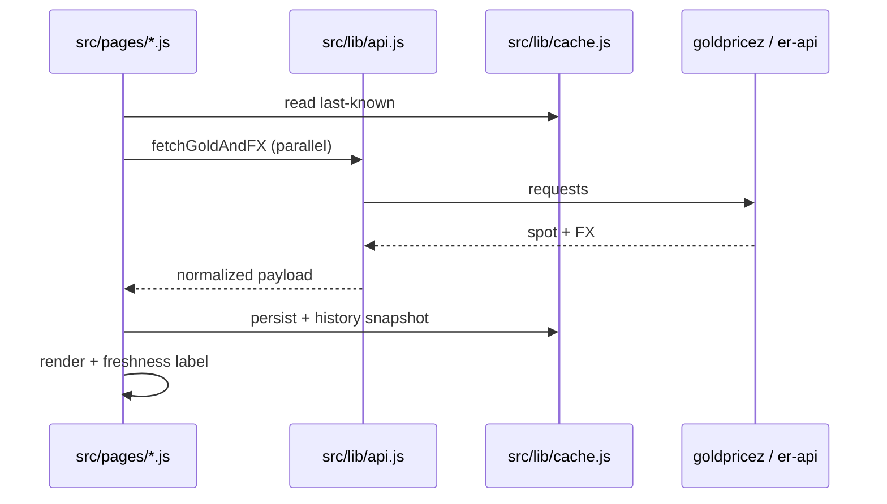

# Appendix C — Module, Data & API Map

> Parent: [`GOLD_TICKER_LIVE_MASTER_WORKBOOK.md`](../GOLD_TICKER_LIVE_MASTER_WORKBOOK.md)

## C.1 Client data pipeline (browser)



| Module | Responsibility |
| ------ | -------------- |
| `src/lib/api.js` | `fetchGold`, `fetchFX`, `fetchGoldAndFX`; simulation hooks for tests |
| `src/lib/cache.js` | localStorage preferences, price cache, history snapshots |
| `src/lib/price-calculator.js` | Gram/ounce/karat math |
| `src/lib/formatter.js` | Display formatting, locale |
| `src/lib/live-status.js` | Market open/closed vocabulary |
| `src/lib/safe-dom.js` | **Only** sanctioned HTML sinks |
| `src/lib/freshness-*.js` | Strip, pulse, policy helpers |
| `src/services/pricingEngine.js` | Higher-level pricing (where used) |

## C.2 Config (single source of truth)

| File | Never duplicate elsewhere |
| ---- | ------------------------- |
| `src/config/constants.js` | Troy oz, AED peg, timing |
| `src/config/karats.js` | Purity factors |
| `src/config/countries.js` | Country metadata |
| `src/config/translations.js` | **All** UI strings EN+AR |
| `src/config/market-intel.js` | Country VAT/making charges |

## C.3 Components (shared chrome)

| Component | Consumed by |
| --------- | ----------- |
| `nav.js` + `nav-data.js` | All public templates |
| `footer.js` | All public templates |
| `ticker.js` / `MarketSummaryTicker.js` | Home, tracker contexts |
| `spotBar.js` | Tracker, country |
| `breadcrumbs.js` | Content, country |
| `adSlot.js` | Monetized surfaces |
| `copy-toast.js` | Copy actions sitewide |

## C.4 Express `/api/v1` route map (high level)

| Prefix | Router file | Public? |
| ------ | ----------- | ------- |
| `/api/v1/health`, `/status`, `/config/public` | `api-v1.js` | Yes |
| `/api/v1/prices/*` | `api-v1.js` | Yes |
| `/api/v1/providers/*` | `api-v1.js` | Mixed |
| `/api/v1/me/*` | `public-accounts.js` | Auth |
| `/api/v1/alerts/*` | `alerts.js` | Token/auth |
| `/api/v1/billing/*` | billing routes | Auth |
| `/api/v1/shops/*` | `shops-v1.js` | Mixed |
| `/api/v1/leads` | `leads.js` | Public POST |
| `/api/v1/events` | `api-v1.js` | Rate-limited |
| `/api/v1/admin/*` | `admin/index.js` | Admin |
| `/api/v1/jobs/check-alerts` | `alerts.js` | Secret header |

### Customer account endpoints (verify dashboard wiring)

| Method | Path | Purpose |
| ------ | ---- | ------- |
| GET | `/api/v1/me` | Profile |
| GET | `/api/v1/me/export` | GDPR JSON export |
| DELETE | `/api/v1/me` | Account deletion |
| PATCH | `/api/v1/me/preferences` | Settings |
| GET/POST/DELETE | `/api/v1/me/watchlist` | Watchlist |
| GET/POST/DELETE | `/api/v1/me/saved-calculations` | Saved calcs |
| GET/POST/DELETE | `/api/v1/me/saved-shops` | Saved shops |

## C.5 Committed data files

| File | Writer | Reader |
| ---- | ------ | ------ |
| `data/gold_price.json` | `gold-price-fetch.yml` | Browser, server fallback, X post |
| `data/last_gold_price.json` | automation | diff/tweet logic |
| `data/shops.js` | sync-db / normalize | shops page |
| `data/automation_runs.json` | observability | admin ops |

## C.6 Build pipeline order

```text
extract-baseline → normalize-shops → render-learn-static-fallback → inject-schema → generateSitemap → vite build
```

Touching generators requires: `npm run build` + `tests/sitemap*.test.js` + SEO validate.

## C.7 Service worker

`sw.js` — precache list must match `check-sw-precache.js`. Version bump on cache-breaking UX changes.

**Forbidden** in routine sessions without plan (workbook Part 10).

## C.8 Import graph rules for agents

- Page scripts import components + lib; avoid page→page imports
- Do not import server code into `src/`
- Country pages: prefer `country-page.js` mount over per-file duplication
