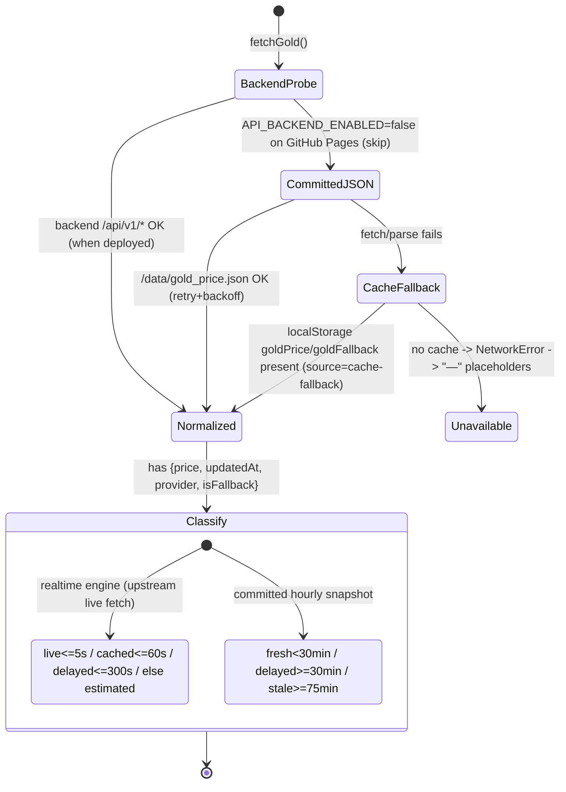

# Phase 4 — Data-source resilience map (audit only)

Track A / Phase 4. Maps the primary/fallback/cached price paths and their staleness thresholds into
a state diagram, feeding **Phase 6** (unified freshness labeling) and **Phase 8** (secondary
provider cross-validation). **Read-only** — the ingest layer (`gold-price-fetch.yml`, Python
adapters) is owner-gated and is documented, not modified.

## Two layers

### 1. Ingest layer — CI (owner-gated, audit-only)

`gold-price-fetch.yml` runs **hourly at :02** and calls `scripts/python/fetch_gold_price.py` with a
provider chain, then `scripts/node/sync-price-snapshot.js`, and commits `data/gold_price.json`.

- **Production provider order:** `gold_api_com → twelvedata_xauusd → fmp_gcusd` (first healthy wins;
  the adapter records the decision chain in the `reason` output).
- **Sanity guards:** `MAX_VALID_XAU_USD=10000` (reject absurd values),
  `MAX_GOLD_FRESHNESS_SECONDS=900` (15 min), `ALLOW_STALE_PRICE=false`. AED is **never** taken from
  a provider — it is the fixed peg.
- Output `data/gold_price.json` carries `provider` + `isFallback` metadata so the client can label
  provenance without guessing.

### 2. Read layer — client (`src/lib/api.js`, in scope for later phases)

FX (`fetchFX`): `open.er-api.com` live → localStorage `fxFallback` → `NetworkError`. **AED is
stripped from the FX response and replaced by `CONSTANTS.AED_PEG` (3.6725)** at every call site, so
the API can never override the peg.

Cache (`src/lib/cache.js`): each save demotes the previous primary to a fallback slot
(`goldPrice`→`goldFallback`, `fxRates`→`fxFallback`), so one bad fetch never erases the last good
value. `loadState()` hydrates gold/FX/dayOpen/history/prefs from localStorage on boot.

## Staleness thresholds (the two systems — root of the R-01 "9-min Live" issue)

| Path          | Source                                     | live | cached | delayed | stale/estimated    | Defined in                    |
| ------------- | ------------------------------------------ | ---: | -----: | ------: | ------------------ | ----------------------------- |
| **Live-API**  | real-time provider fetch (realtime engine) | ≤5 s |  ≤60 s |  ≤300 s | >300 s → estimated | `src/lib/freshness-policy.js` |
| **Age-based** | committed hourly `gold_price.json`         |    — |      — | ≥30 min | ≥75 min → stale    | `src/lib/live-status.js`      |
| **FX**        | `open.er-api.com`                          |    — |      — |       — | ≥26 h → stale      | `src/lib/live-status.js`      |
| **SLO**       | user-visible "Live" cap                    | ≤5 s |        |         |                    | `REALTIME_LIVE_MAX_AGE_MS`    |

Polling (`src/lib/realtime-config.js`): visible/hidden poll (hidden 5 s), backoff `[1,2,3,5]s`,
history refresh 60 s. `ProviderHealthMonitor` (`src/lib/provider-health.js`) gates whether the
`live` state is even eligible (unhealthy provider ⇒ never "live").

## Resilience assessment & hand-off

| Observation                                                                                                                  | Consequence                                                                                                      | Owning phase                                                                                                                                                                   |
| ---------------------------------------------------------------------------------------------------------------------------- | ---------------------------------------------------------------------------------------------------------------- | ------------------------------------------------------------------------------------------------------------------------------------------------------------------------------ |
| Two freshness systems coexist; the **age-based** path can present a <30 min committed snapshot in a way that reads as "Live" | R-01 trust issue — a 9-min-old hourly price labelled "Live"                                                      | **Phase 6** — ensure the committed/age path uses **Updated / cached / delayed / stale** and reserves **"Live"** for the ≤5 s realtime path only; unify both into one component |
| shops.html sticky bar reads a different snapshot source than the page ticker                                                 | Bar shows dashes while ticker shows live                                                                         | **Phase 6** — single snapshot source                                                                                                                                           |
| Fallback chain is deep (backend → committed JSON → localStorage → error) and degrades to `—`, never fake numbers             | ✅ Healthy — matches freshness contract                                                                          | keep; regression-guard in **Phase 30**                                                                                                                                         |
| Cross-validation would compare the primary vs a second independent provider and flag divergence                              | Divergence detection is client-safe (read committed metadata); **enabling it live edits `gold-price-fetch.yml`** | **Phase 8** — implement detection behind a flag; production wiring is owner-gated                                                                                              |
| AED peg is structurally protected (stripped from FX, hardcoded)                                                              | ✅ Invariant safe                                                                                                | —                                                                                                                                                                              |

**No code changed in this phase.** The single highest-value follow-up is Phase 6 reconciling the two
freshness paths so "Live" is never shown for the hourly committed source.
